::: {style="text-align: right;"}
 
:::

For the YouTube livestream schedule, see [here](https://www.youtube.com/@cytometryinr)

For screen-shot slides, click [here](/course/03_InsideFCSFile/slides.qmd)

 

---

# Background

During weeks twelve through fourteen of the [Cytometry in R course](https://umgcccfcsr.github.io/CytometryInR/), we primarily focus on how to work with raw Spectral Flow Cytometry (SFC) .fcs files. During Week 12, we learn how to extract out and characterize fluorescent signatures that are present in our unmixing controls (both single-color and unstained). This is followed up on Week 13 by learning how to compare these signatures with each other, allowing us to predict how they will interact in context of a full SFC panel. Finally, in Week 14, we take the fluorescent signatures we have derived from our unmixing controls and use them to unmix full-stained samples. 

Due to the Cytometry in R's course use of GitHub, we are not able to include the full-sized .fcs files due to individual file size sharing constraints. The datasets used during Week's 12 through 14 were consequently downsampled to get around this issue. However, working with the complete datasets can provide additional insight (as well as more closely replicate the experience of working with your own datasets).  This walk-through therefore contains the steps needed to both retrieve and process the original .fcs files that were used from the [ImmPort](https://www.immport.org/) repository. 

ImmPort (Immunology Database and Analysis Portal) is a open access platform for research data sharing, primarily intended as a repository for datasets generated as part of [NIH](https://www.nih.gov/) and [NIAID](https://www.niaid.nih.gov/) funded grants. It includes many different types of immunological data, including  conventional, spectral and mass cytometry datasets. 

We are slated to cover how to retrieve data programmatically from ImmPort via the API [later in the course](https://umgcccfcsr.github.io/CytometryInR/Schedule.html#databases-and-repositories), however, in the meanwhile, this walk-through will cover how to access and download individual datasets via the website portal. This can be a little bit of challenge for the un-initiated, so we will depict one of our typical workflows that can be used. 

# Walk Through

## Accessing ImmPort

To start, first navigate to the [ImmPort repository](https://www.immport.org/). The landing page at the time of writing this walk-through can be seen in the screenshot below. 

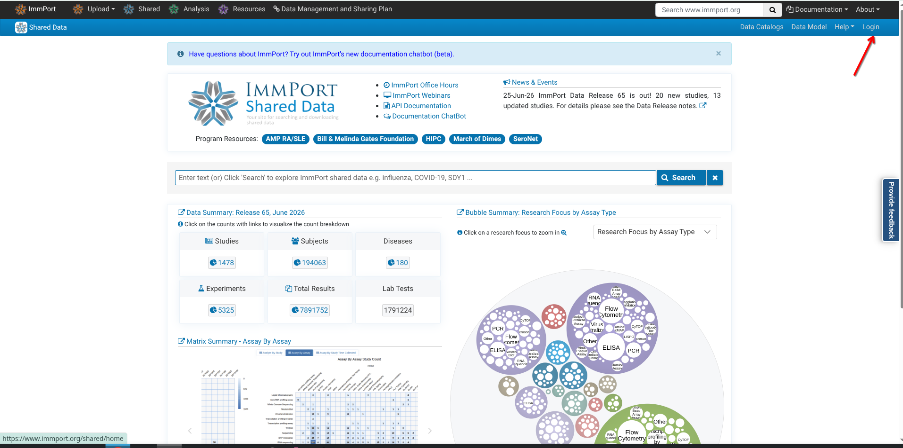

If this is your first time using the ImmPort repository, you will need to create a free account. The simplest way to start the process is to go ahead and click on the [login button](https://www.immport.org/auth/login) on the upper-right hand of the screen. 

This will take you to the login page, which also includes the the option to register for an ImmPort account. Go ahead and select the option to register. 

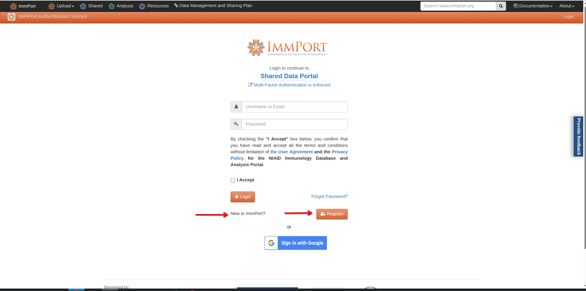

You will then reach a page with a notice about the next steps and the need to accept ImmPort's [terms of use](https://docs.immport.org/home/agreement/) before being able to access the datasets. Select Continue. 

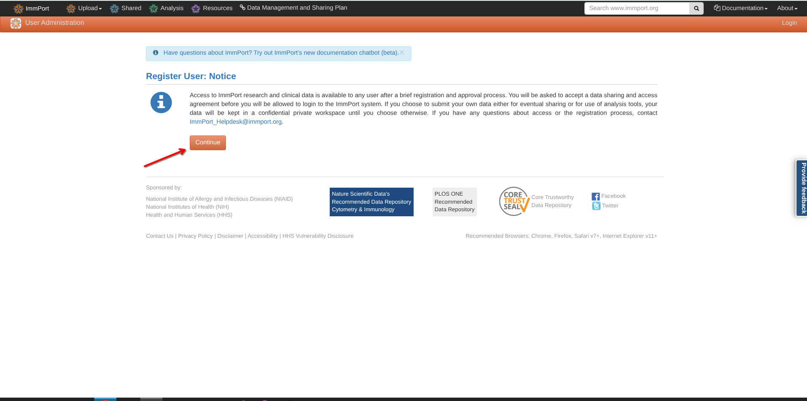

You will then be prompted to fill out various fields that are needed to create your account. When complete, proceed with your account registration by selecting Register. 

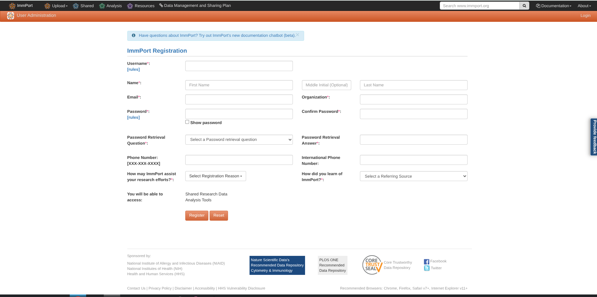

You will next proceed through several additional steps before completing account registration. At this point, you will end back up on the login page. 

:::{.callout-important}
If you are registering for the first time, please take some documentation screenshots of these last couple registration steps (leave blank/whiteout any important personal information) and post them to this [issue page](https://github.com/UMGCCCFCSR/CytometryInR/issues/217), I will update this page accordingly. Thanks! David 
:::

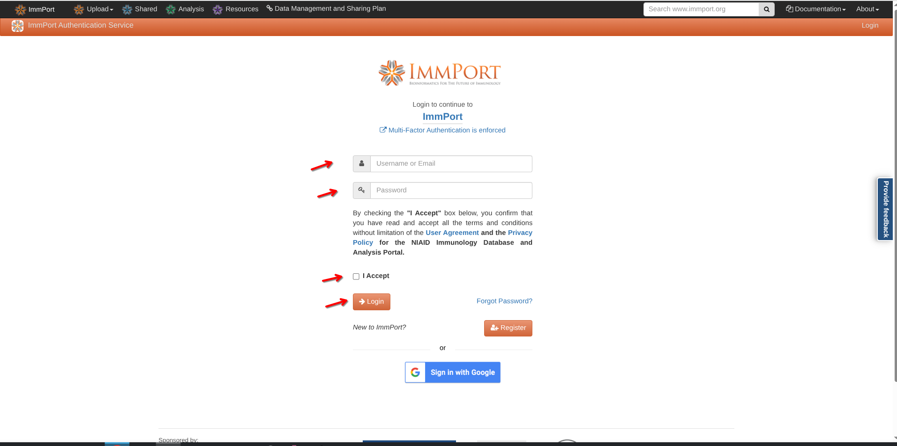 

Proceed to provide your loing information, and select login. You will then start the two-factor authentication process. Go to your email and retrieve the code that was sent to you.

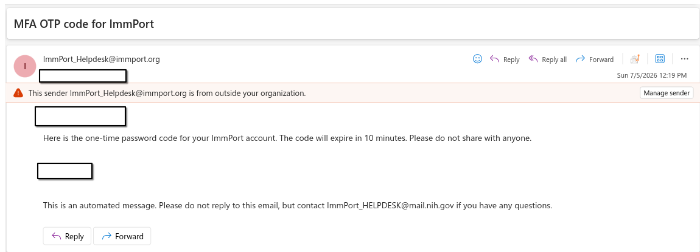

Return to the two-factor authentication screen and submit the provided code. 

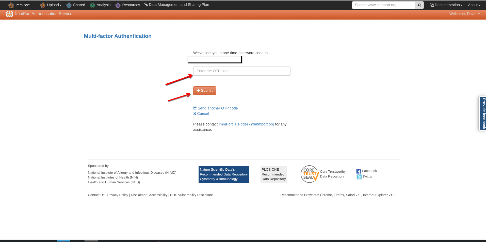

And with that done, Congratulations! You have now both registed and logged in to ImmPort. You are now (finally) able to access and download the dataset for this example.

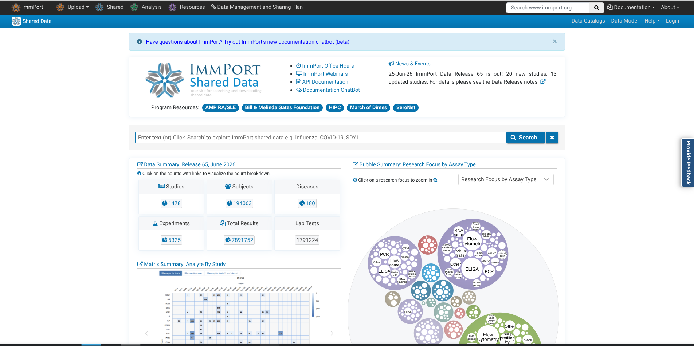

## Downloading Datasets

As aforementioned, [ImmPort](https://docs.immport.org/home/about/) contains many different forms of Immunological data, including conventional, spectral and mass cytometry datasets. 

The data used as examples for week's 12 through 14 was originally from [SDY3080](https://www.immport.org/shared/search?text=SDY3080), which is the SFC dataset associated with our [Rach et al. 2025](https://www.frontiersin.org/journals/immunology/articles/10.3389/fimmu.2025.1628145/full) *Frontiers in Immunology* paper looking at Cord Blood Innate-Like T cell responses in neonates born to healthy women and women living with HIV. It is one of the few spectral flow cytometry datasets currently on ImmPort to also include the raw (not-yet-unmixed) data. 

To get startEd, following login, proceed to look up [SDY3080](https://www.immport.org/shared/search?text=SDY3080) in the search bar

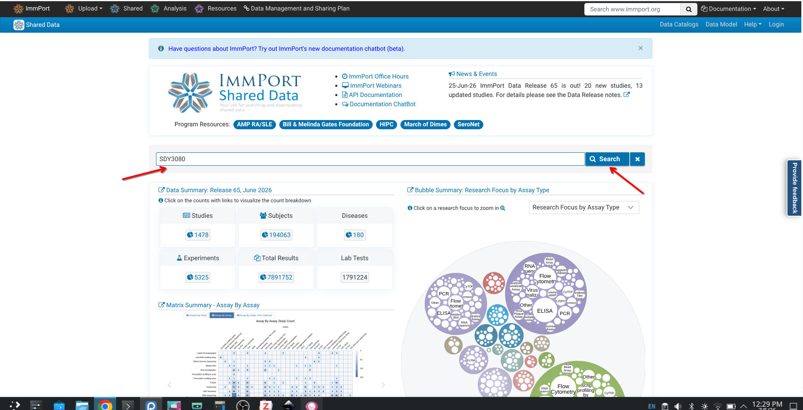

You will end up in the search results page. Since we looked up based on the study accession number, it comes up right away. 

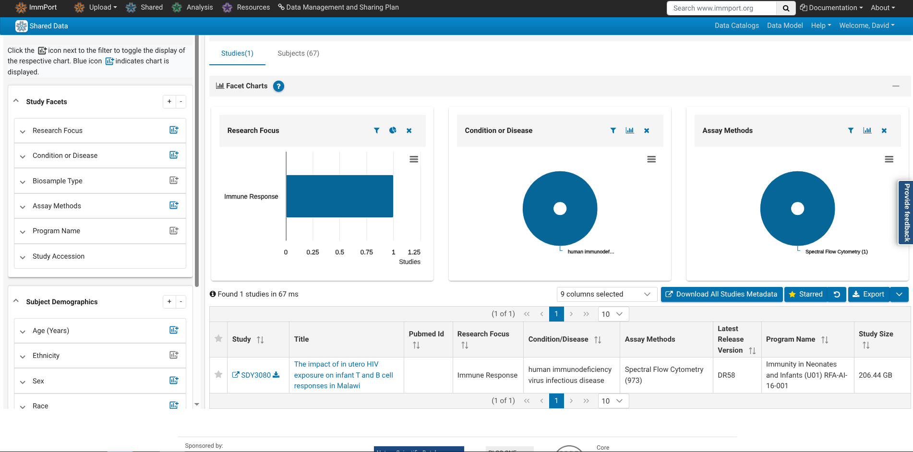

To get started accessing the data, go ahead and click on the study accession number to proceed to the study-specific landing page. 

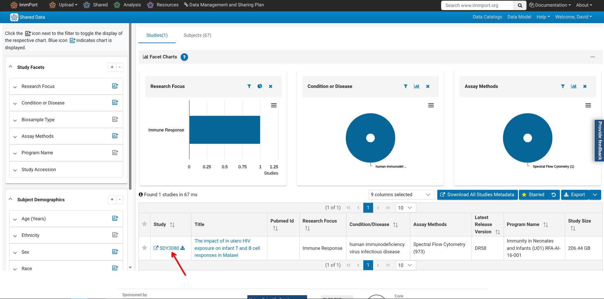

Under Download options on the upper-right, proceed to select the Study Package (Web) option. 

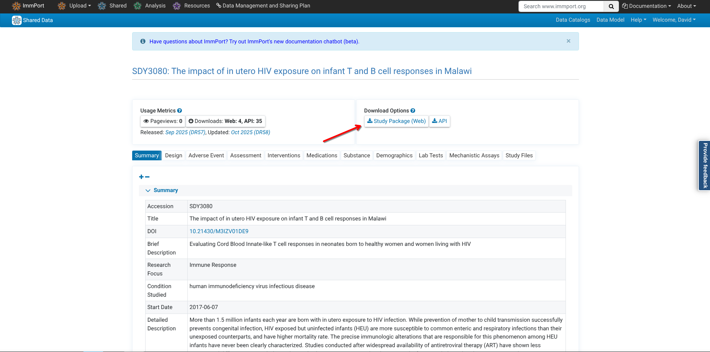

You will now be taken to the studies data folder. ImmPort studies contain additional layers of metadata (which assist in the re-use of the data for purposes beyond their original intention). We will cover these in greater later on in the [course](https://umgcccfcsr.github.io/CytometryInR/Schedule.html#databases-and-repositories), for now, proceed to select the Results Folder. 

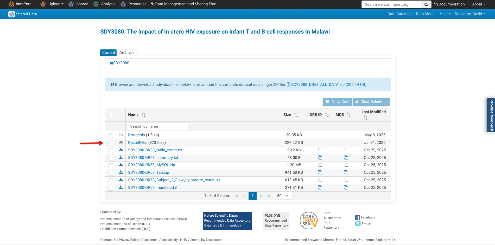

Once within the Results folder, proceed to select the Flow_cytometry_result subfolder. 

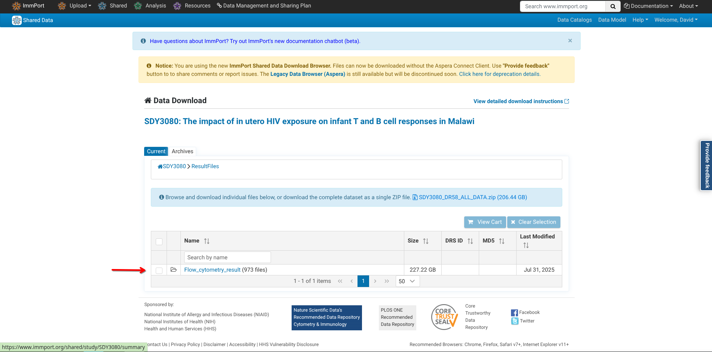

### Retrieving Multiple Files

At this point, you have reached the page where the individual .fcs files are stored. Proceed to click on the size tab a couple times to re-arrange from the largest to smallest file size to get a better sense of the dataset file sizes. 

Once this is done, change the option of number of files displayed to show the maxinum number of files at once (200). 

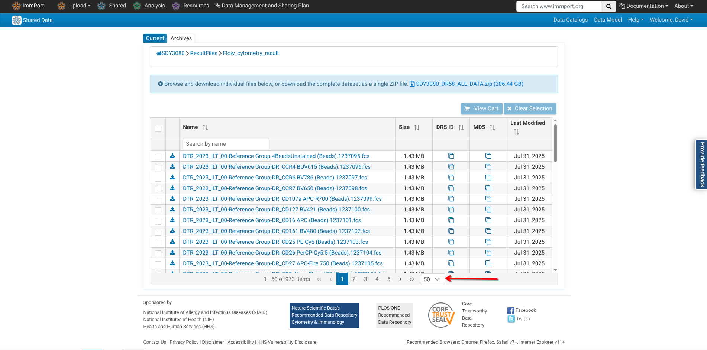

For the Week's 12 through 14 examples, we were working with unmixing controls from the first two experiments in the SDY3080 dataset (ILT_00 and ILT_01). The ILT_00 contained a set of a bead single-color unmixing controls acquired before the experimental series start. The first actual experiment is denoted by ILT_01, and consist of the first set of cell single color reference controls; specimen-specific-condition-specific unstained unmixing controls; and full-stained samples (Ctrl_Antibody, Ctrl_Tetramer, PMA)

You can select multiple files to download by clicking on the checkboxes on the left-side of the screeen. 

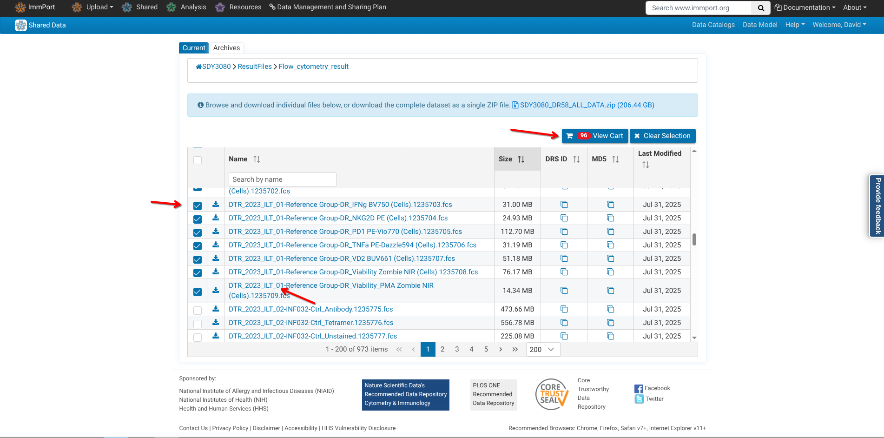

Once the specimens of interest have been selected, proceed to click on the Download Cart option. 

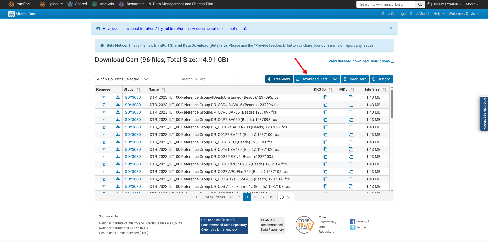

You will then encounter a Confirm Download pop-up. If these were the files you intended to download, select Yes. 

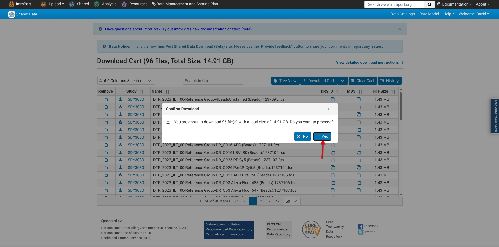

The Preparing Download pop-up screen will then appear as your zipped folder is prepared. 

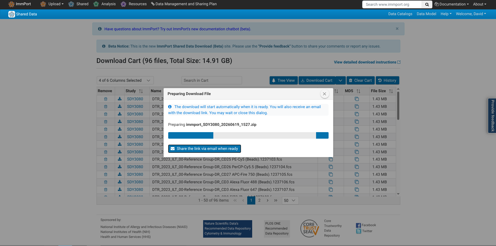

If the retrieval process is succesful, you will then be prompted to save the folder to a desired location on your computer. Go ahead and proceed to extract out the contents for subsequent use. 

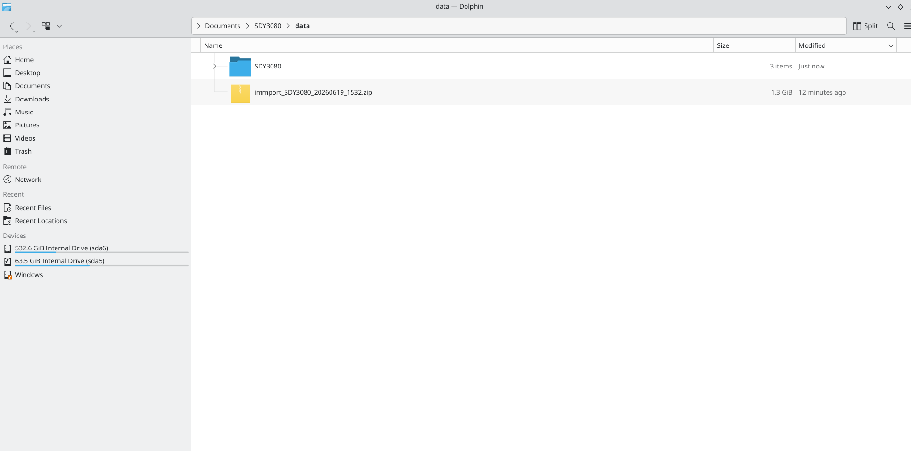

### Retrieving Individual Files

Occasionally, when attempting to download via the web, ImmPort will fail out on during the attempt, resulting in an email similar to this one ending up in your inbox.

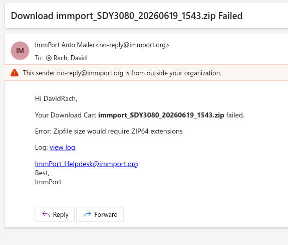

From our limited testing, this often appears when the combined file download size exceeds a certain size. When the total files being downloaded are under 1 GB, the extension mentioned in the email is apparently not generated, and the download proceeds normally. 

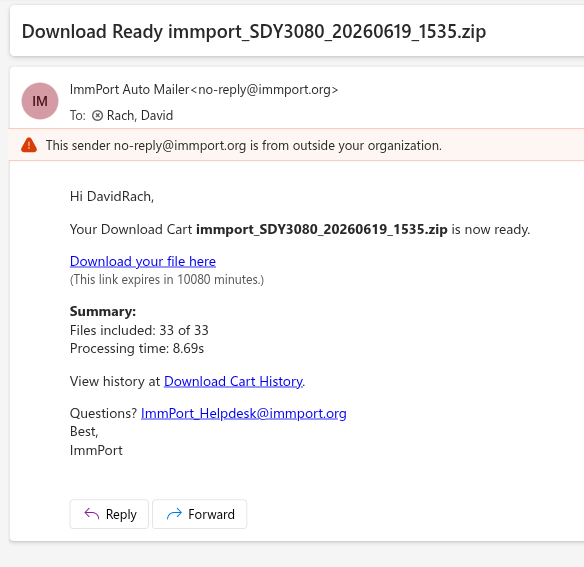

Alternatively, you can download indiviudal files by selecting the download arrow next to each file to download individually if this occurs

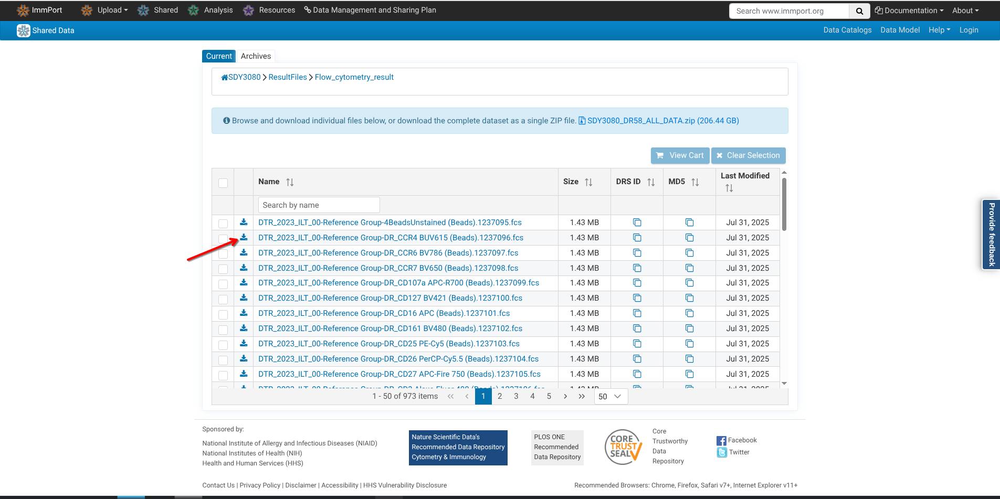

Beyond the manual download options, there are several other ways to more efficiently download the files via the API, which are outside the scope of this smaller walk-through. We intend to cover these in greater depth in the [future](https://umgcccfcsr.github.io/CytometryInR/Schedule.html#databases-and-repositories)

## Organizing the Retrieved Files

At this point, for the walk-through, we chose to organize our retrieved files in the following manner. This simplified our ability to quickly switch between .fcs file types (single color beads or cells, unstained, full-stained) when working on the various downstream processing steps. 

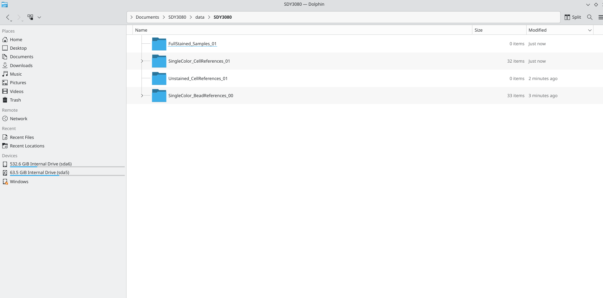

A couple things to note going forward if you are following along, the file sizes of the individual cell single-color control can be seen here

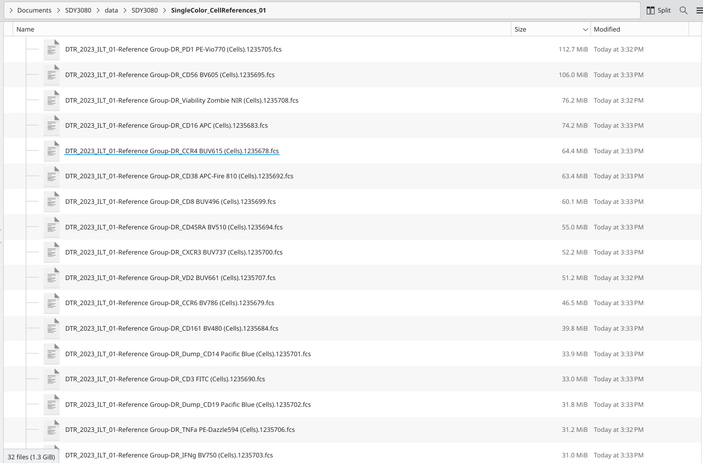

By contrast, the single-color bead controls are much smaller

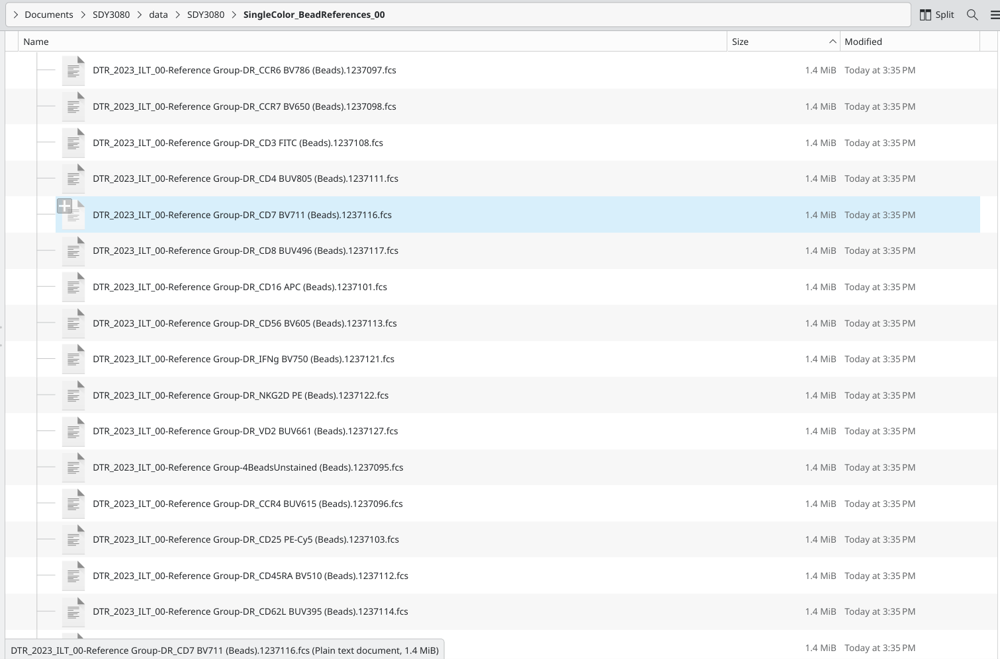

This dataset also contained specimen-matched condition-matched unstained samples that were also acquired to allow for autofluorescence signature profiling. The amount of cells used varied depending on how many cells were left after the full-stained sample conditions had been aliquoted, but as can be seen, some of these files are quite large. 

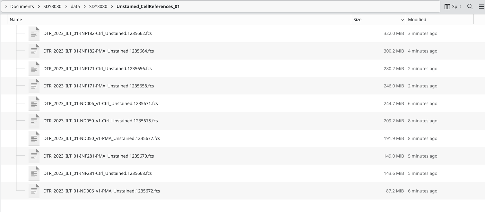

Likewise, as anticipated, the full-stained .fcs file sizes are also large, given thatover  > 3 million events were acquired in an attempt to profile cord blood Innate-like T cells. 

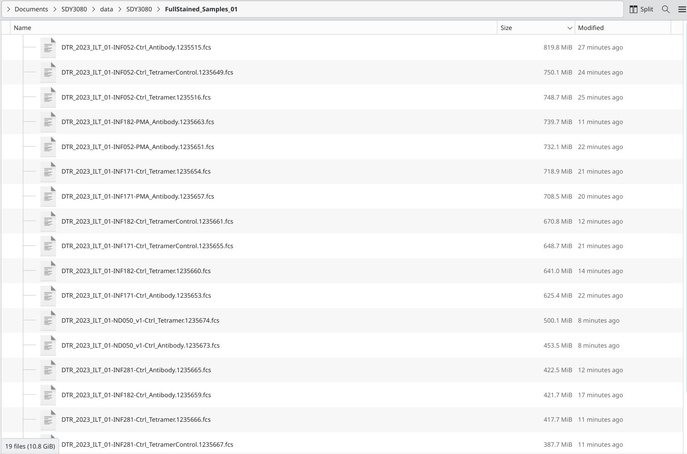

# Take Away

In this walk-through, we briefly covered how to register for an ImmPort account, how to access individual datasets, and how to download the .fcs files that were used for the Cytometry in R course during weeks 12 through 14. 

Beyond what we showcased here, there are a lot of additional repositories on ImmPort containing interesting cytometry datasets. Showcasing how to identify, access and download these in a more efficient manner will be the focus later on during the [course](https://umgcccfcsr.github.io/CytometryInR/Schedule.html#databases-and-repositories). You are however more than welcome to investigate on your own until then. 

# Additional Resources

[Searching ImmPort Shared Data](https://docs.immport.org/help/navigation/cdt/)

[How to Download Data](https://docs.immport.org/download/)

