::: {style="text-align: right;"}
[](https://www.gnu.org/licenses/agpl-3.0.en.html) [](http://creativecommons.org/licenses/by-sa/4.0/)
:::

For the YouTube livestream schedule, see [here](https://www.youtube.com/@cytometryinr)

For screen-shot slides, click [here](/course/03_InsideFCSFile/slides.qmd)

<br>

---

# Background

During weeks twelve through fourteen of the [Cytometry in R course](https://umgcccfcsr.github.io/CytometryInR/), we primarily focus on how to work with raw Spectral Flow Cytometry (SFC) .fcs files. During Week 12, we learn how to extract out and characterize fluorescent signatures that are present in our unmixing controls (both single-color and unstained). This is followed up on Week 13 by learning how to compare these signatures with each other, allowing us to predict how they will interact in context of a full SFC panel. Finally, in Week 14, we take the fluorescent signatures we have derived from our unmixing controls and use them to unmix full-stained samples. 

Due to the Cytometry in R's course use of GitHub, we are not able to include the full-sized .fcs files due to individual file size sharing constraints. The datasets used during Week's 12 through 14 were consequently downsampled to get around this issue. However, working with the complete datasets can provide additional insight (as well as more closely replicate the experience of working with your own datasets).  This walk-through therefore contains the steps needed to both retrieve and process the original .fcs files that were used from the [ImmPort](https://www.immport.org/) repository. 

In the [Set Up for Signature Retrieval](/course/SDY3080/SetUp.qmd) walk-through, we transformed, gated and verified the gate placement for each of our unmixing control GatingSet objects (Bead Single Colors, Cell Single Colors, Cell Unstained), before saving each as an intermediate .gs objects we could work with more readily in the future without needing to re-draw and re-adjust these gates. We will pick back up with these intermediates, and work towards retrieving the fluorescent signatures from each of the single-colors to incorporate into a signature matrix. This will be used not only for comparisons during Week 13, but also for use in unmixing the full-stained samples during Week 14. 

This walk-through will share a lot of the content that is being covered in [Week 12](). However, Week 12 walk-through is more granularly focused on explaining the individual signature extraction to break open what for many in the community is a black-box. This walk-through is more focused on providing a faster method by which we can do this at scale for our experiments, in a manner closer to what we would experience using commercial software, while providing launching points for delving further into the aggregated single-cell normalized signatures that will be the focus of the next walk-through. 

# Walk-through

## Checking package versions

As was mentioned in the last walk-through, we are using the developmental version of the `flowGate` package that contains the new functions needed to adjust individual gates for individual specimens. Due to the twice yearly release cycle of Bioconductor packages, the easiest way to  take advantage of these new functions is to install this version of `flowGate` via GitHub. 

If you have already done this in the last walk-through, you are all set. Otherwise, as always, it is easier if you first remove the R package, close and reopen Positron, then install the new version. 

```{r}
#| eval: FALSE

# Remove existing installation
remove.packages("flowGate")

# Install the new version
remotes::install_github("NKInstinct/flowGate") # If non-functional, try the class fork at "DavidRach/flowGate"
```

Once this is done, check what version is installed using the `packageVersion()` function. The version containing both the ggplot2/ggcyto bug fixes as well as the new gating functions should be any version starting at/after 1.31.1

```{r}
packageVersion("flowGate")
```

Additionally, we will be using the most recent version of the Luciernaga package, which has new orchestration functions intended to make setting up fluorophore-specific gates for the correct single-color easier than it would be to specify each of these gates individually. 

If you run `packageVersion()`, you should have version 0.99.10 or greater installed to take advantage of the orchestration functions that are needed for this walk-through. 

```{r}
packageVersion("Luciernaga")
```

If you ned to install the newest version, proceed and repeat the uninstall/reinstall steps below. 

```{r}
#| eval: FALSE

# Remove existing installation
remove.packages("Luciernaga")

# Install the new version
remotes::install_github("DavidRach/Luciernaga")
```

## Initial Set Up

Having verified we have the correct package versions installed, we can proceed to attach the packages needed to our local environment via the `library()` call. 

```{r}
library(flowWorkspace)
library(flowGate)
library(dplyr)
library(purrr)
library(stringr)
library(Luciernaga)
```

With this done, lets re-specify the file paths to our Storage and Output locations. 

```{r}
#StorageLocation <- file.path("course", "SDY3080", "data", "SDY3080")
StorageLocation <- file.path("data", "SDY3080")

#OutputLocation <- file.path("course", "SDY3080", "outputs")
OutputLocation <- file.path("outputs")
```

Next up, given that not everyones workstations will be set up in the same way, I recommend working through each GatingSet separately. This in turn should reduce the total amount of RAM being taken up at any one point of time. 

## Beads Single-Colors

Let's start with our Bead Single Color Unmixing controls, which theoretically should be the easier examples to work with.  To get started, letss reload the GatingSet from where we stored the intermediate .gs file. For easier handling, we will save under the same name as we had been using in the previous walkthrough. 

```{r}
#| eval: FALSE
BeadsStoredHere <- file.path(OutputLocation, "BeadsSCs_GS.gs")
BeadsSC_GatingSet <- load_gs(BeadsStoredHere)
```

```{r}
#| eval: FALSE
pData(BeadsSC_GatingSet)
```

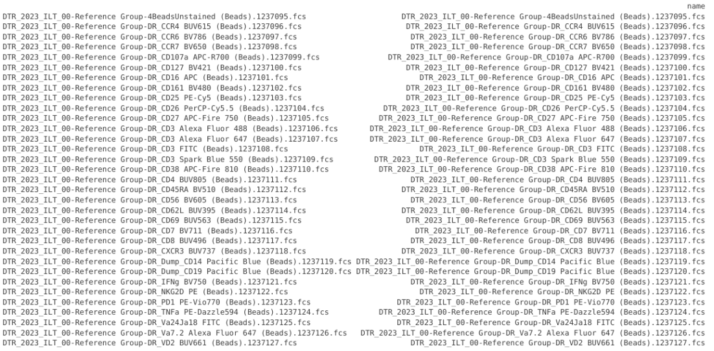

### Updating Metadata

From the metadata, we can see that all the bead single-color controls appear to have been acquired as part of the ILT_00 experiment. If we checked the methods/metadata for the [SDY3080](https://www.immport.org/shared/study/SDY3080/download/Protocols?page=1) study (or alternatively, the internal keywords for the individual .fcs files), we would find that these files were acquired on a Cytek Aurora 5-laser instrument.  

Currently, within the file name, we have several bits of information that would be useful to extract out and place in their column (either in `pData()` or left as a stand-alone data.frame/tibble). This includes Fluorophore, Antigen, and control type ("Beads"). Seeing as we currently have just a name column, we can repeat the appending metadata steps that we have encountered previously, only needing to modify the RegEx syntax needed for the `stringr` package to retrieve the bits of information. 

```{r}
#| eval: FALSE
bead_pd <- pData(BeadsSC_GatingSet)

Updated_bead_pd <- bead_pd |> mutate(
    raw = str_extract(name, "(?<=DR_)[^(]+(?=\\()"), 
    Antigen = raw |>
      str_trim() |>
      str_extract("^\\S+"), 
    Fluorophore = raw |>
      str_trim() |>
      str_remove("^\\S+\\s+"), 
    Type = name |>
      str_extract("(?<=\\()([^)]+)(?=\\))"),
    raw = NULL
  )

Updated_bead_pd <- Updated_bead_pd |> relocate(Fluorophore, Antigen, Type, .after="name")
```

```{r}
#| eval: FALSE
Updated_bead_pd
```

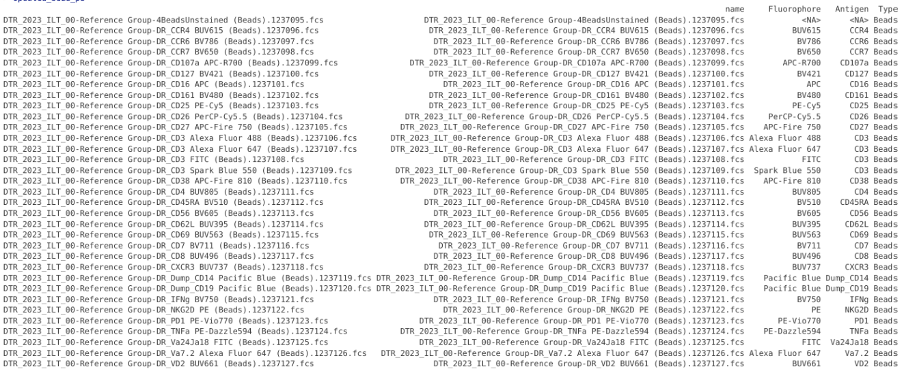

While skimming this updated output, we can notice that both Fluorophore and Antigen ended up as '< NA >'' for the 4BeadsUnstained sample (which didn't conform to the same RegEx pattern seen by the other unmixing controls). Additionally, for this particular Cytek Aurora, the naming convention that was inputted for PE-Vio 770 and PE-Dazzle 594 differs, with no space occuring between Vio770 and Dazzle594. We can correct these small issues through use of the `dplyr` packages `case_when()` function in conjunction with the `mutate()` function. 


```{r}
#| eval: FALSE
Updated_bead_pd <- Updated_bead_pd |> mutate(
    Antigen = case_when(
      str_detect(name, "BeadsUnstained") ~ NA_character_,
      .default = Antigen
    ),
    
    Fluorophore = case_when(
      str_detect(name, "BeadsUnstained") ~ "BeadUnstained",
      .default = Fluorophore
    )
  )

Updated_bead_pd <- Updated_bead_pd |> 
  mutate(Fluorophore = case_when(
    Fluorophore == "PE-Vio770" ~ "PE-Vio 770",
    Fluorophore == "PE-Dazzle594" ~ "PE-Dazzle 594",
    TRUE ~ Fluorophore
  ))
```

```{r}
#| eval: FALSE
Updated_bead_pd
```

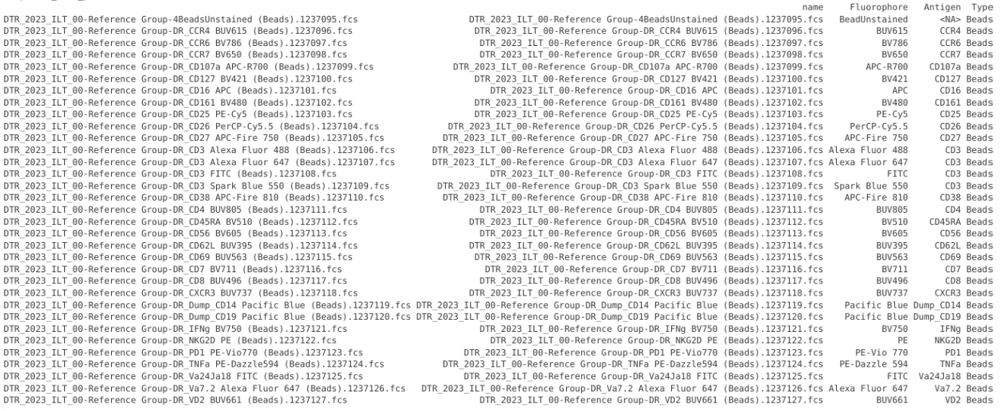

With these adjustments now made, we can overwrite the existing metadata, replacing with our variant.

```{r}
#| eval: FALSE
pData(BeadsSC_GatingSet) <- Updated_bead_pd
pData(BeadsSC_GatingSet)
```

### Template Set Up

With the metadata now updated, let's step back and consider some important elements that are missing. Currently, our single-color unmixing controls are present in a relatively generic GatingSet (last common gate being "scatter"). From here, based on the individual single-color control, we will want to create an individual gate for what should be the peak detector for the given fluorophore. We will then want to be able to adjust this individual gate (to accord with best practices), at which point we can extract out the average fluorescent signature for the beads within that gate. However, since these are single-color controls, we will also need to subtract out a background signal for beads, so we will need to provide a designated Negative specimen for this step. 

Lets start off by first retrieving back out our metadata, saving it as a new object Template. 

```{r}
#| eval: FALSE
Template <- pData(BeadsSC_GatingSet)
```

Using `mutate()`, lets go ahead and create two new columns, one for Detector (left empty as denoted by ""), and Negative (providing value "BeadsUnstained" to all since there is only one unstained sample in this GatingSet)

```{r}
#| eval: FALSE
Template <- Template |> mutate(Detector="", Negative="BeadUnstained")
```

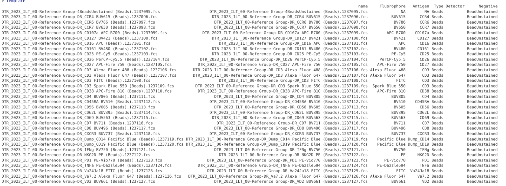

Since this data originates from a 5-laser Cytek Aurora with 64, `Luciernaga` has fairly good coverage of the fluorophore signatures. We can iterate in the individual values found in the "Florophore" column, and retrieve the corresponding peak detector. 

```{r}
#| eval: FALSE
Template <- Template |> mutate(
    Detector = map_chr(Fluorophore, \(f) DetectorGuess(x = f, NumberDetectors = 64))
  )
```

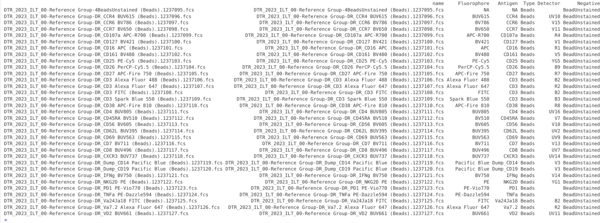

Alternatively, if you are working with data from a different spectral flow cytometer manufacturer, you can always specify the correct detectors for the given fluorophore manually (making sure to provide matching syntax to what you would see in the `colnames()`)

```{r}
#| eval: FALSE
colnames(BeadsSC_GatingSet)
```

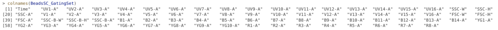

While you could use `mutate()` and `case_when()` to do this entirely programmatically, you can also use `write.csv()` to save out as a .csv file (and also to provide an intermediate point to fall back on). 

```{r}
#| eval: FALSE
StoreHere <- file.path(OutputLocation, "BeadMatch.csv")
write.csv(Template, StoreHere, row.names=FALSE)
```

It is also a good idea to duplicate the file and rename it (in this case I called it "UpdatedBeadMatch"). This ensures that should your R script get run after you incorporated in edits by hand, these are not lost.

```{r}
StoreHere <- file.path(OutputLocation, "UpdatedBeadMatch.csv")
BeadMatchTemplate <- read.csv(StoreHere, check.names=FALSE)
```


At this point, we have an assembled template, containing most of the needed information we will need to first create the correct peak detector gates for each single-color, and subsequently match to the sample (BeadsUnstained) from which the background for subtraction is set to be extracted. 

### Removing Duplicates

Before proceeding, lets double check that there are no single-color controls that are present twice in the GatingSet. 

```{r}
BeadMatchTemplate |> group_by(Fluorophore) |> mutate(Count=row_number()) |>
     ungroup() |> filter(Count > 1) |> pull(Fluorophore) # Spot duplicated fluorophore references
```

In this case, we have a few. Lets isolate them for for now and see whats up. 

```{r}
BeadMatchTemplate |> filter(Fluorophore %in% c("Pacific Blue", "FITC", "Alexa Fluor 647"))
```

In this particular case, one Fluorophore (Pacific Blue) is the Dump (Lineage -) fluorophore meant to exclude both B cells (CD19) and Monocytes/Myeloid (CD14) cells. If we check the individual .fcs files, the CD14 staining is the brightest in terms of MFI, so we can likely keep this one for use in the signature matrix.

For the other two Fluorophores (Alexa Fluor 647 and FITC/Alexa Fluor 488), they correspond to the markers used to characterize the Mucosal-associated Invariant T cells (MAITs, Va7.2) and Natural Killer T cells (NKTs, Va24Ja18). Since these can be rare populations, for cell single-color controls, a back-up of the same fluorophore on CD3 instead was also acquired. These in turn were also used for the single-color bead controls to provide equivalents.
 
Additionally, checking the ImmPort metadata and the paper, the Va24Ja18 antibody vs. hCD1d tetramer were on FITC/Alexa Fluor 488 respectively, so there is an additional single-color present than would be expected. 

Ultimately, we can exclude these individual files from use in creating the gates by filtering out their names from the template. 

```{r}
KeptBeads <- BeadMatchTemplate |>
     filter(!name %in% "DTR_2023_ILT_00-Reference Group-DR_Dump_CD19 Pacific Blue (Beads).1237120.fcs") |>
     filter(!name %in% "DTR_2023_ILT_00-Reference Group-DR_CD3 Alexa Fluor 488 (Beads).1237106.fcs") |>
     filter(!name %in% "DTR_2023_ILT_00-Reference Group-DR_CD3 Alexa Fluor 647 (Beads).1237107.fcs") |>
     filter(!name %in% "DTR_2023_ILT_00-Reference Group-DR_CD3 FITC (Beads).1237108.fcs")  
```

And checking quickly, we can see no duplicate fluorophores are left

```{r}
KeptBeads |> group_by(Fluorophore) |> mutate(Count=row_number()) |>
     ungroup() |> filter(Count > 1) |> pull(Fluorophore) # No duplicates
```

```{r}
KeptBeads
```

We have 29 rows (one including an unstained). The Viability (Zombie NIR)  fluorophore was only acquired with cells, so given this datasets context, everything checks out (yes, this is why metadata for an ImmPort repository is important, can you imagine trying to figure this all out without help!?!?!?!)

### InitialUnmixSpanGates

As we saw during [Week 12](), even when working with a single-fluorophore, there are a lot of moving pieces when it comes to extracting out a normalized fluorescent signature from an individual single-color. Combined with the fact that most spectral flow cytometry panels feature more than just one fluorophore, the need to be able to scale up accordingly is important if we have any hope of routinely unmixing in R. 

Fortunately, `flowGate` provides an easy mechanism by which we can create "spanGates". Now that the new version includes the ability to modify individual gates, this means that once the gates are created, adjusting them after the fact is relatively feasible. The only tricky component remaining was creating peak detector gates based on the correct fluorophore single color control. To faciliate this process, `Luciernaga` now has an `InitialUnmixSpanGates()` function, that when provided the GatingSet object and completed template, will iterate through the gate creation process for you. Subsequently, you would only need to adjust the "spanGates" that get created. 

Double checking, lets see which gates are currently present on our GatingSet

```{r}
#| eval: FALSE
plot(BeadsSC_GatingSet)
```

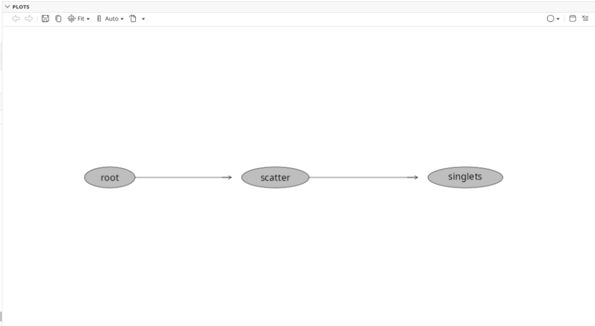

Since we are working with beads, lets grab that final cleanup gate "singlets". Lets also set the initial gate boundaries (based on percentiles) to 0.75 and 0.80 so that we can make sure to see the gates as we iterate through their creation. 

```{r}
#| eval: FALSE
InitialUnmixSpanGates(template=KeptBeads, gs=BeadsSC_GatingSet, subset="singlets", minpercentile=0.75, maxpercentile = 0.99)
```

As the gates get created, the progress bar in turn gets updated

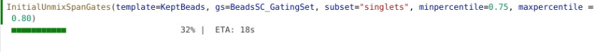

And finally, let's check what gates are now present

```{r}
#| eval: FALSE
plot(BeadsSC_GatingSet)
```

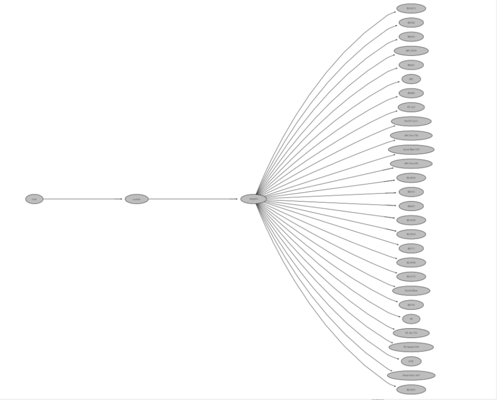

### CheckUnmixingSpanGates

Alright, the most tedious part of the process (individual peak detector gate creation) is now out of the way. Lets now move on to fixing this initially applied gate placements, because there is no way "minpercentile=0.75" and "maxpercentile = 0.80" are correct across the board. 

#### Behind the Scenes

First off, before running `Luciernaga`'s `CheckUnmixSpanGates()` function, lets check some of the basic mechanics that it is iterating through behind the scenes. First, lets start by running `gs_apply_gate_check()` for the appropiate single-color control specimen, with the corresponding newly created gate. 

```{r}
#| eval: FALSE

# pData(BeadsSC_GatingSet) # Sample 16 is the APC-Fire 810 single color unmixing control

gs_apply_gate_check(gs=BeadsSC_GatingSet, gate="APC-Fire 810", sample=16, AdjustAll=FALSE)
```

spanGate should already be selected, to adjust the gate, draw a span gate for the desired region of interest. Then select done. 

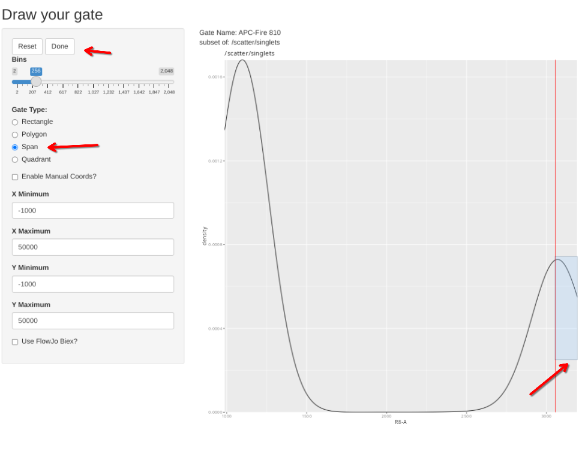

Sometimes, the plot is off-scale. To rescale, note the approximate X value that you want to increase to, select enable manual coords, enter the value, and then proceed and redraw accordingly (please note some sporadic bugs present)

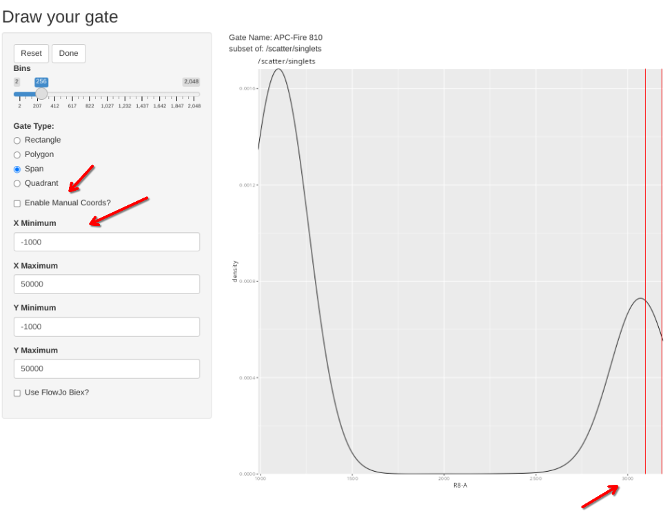

Lets verify that the gate edit was indeed recorded. 

```{r}
#| eval: FALSE
gs_pop_get_gate(BeadsSC_GatingSet, "APC-Fire 810")
```

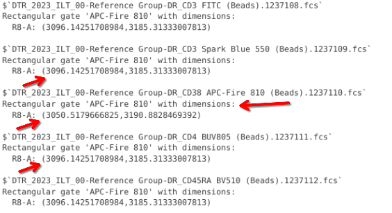

As you can see, only the coordinates for our designated specimen were adjusted, with all the other spans remaining at their initial default. If we had wanted wanted to adjust across the board, we would set the AdjustAll argument to FALSE (which we will explore more in-depth during [Week 13] when deriving spillover matrices) 

### Iterating through the Spans

Now that we have a bit of insight as to the mechanics, lets run `CheckUnmixingSpanGates()`. It will iterate through the gates designated by the template, launching the Shiny app for each gate sequentially. This wrapper function enables a quicker method by which the gates from `InitialUnmixSpanGates()` can be adjusted. 

```{r}
#| eval: FALSE
CheckUnmixingSpanGates(template=KeptBeads, gs=BeadsSC_GatingSet, AdjustAll=TRUE)
```

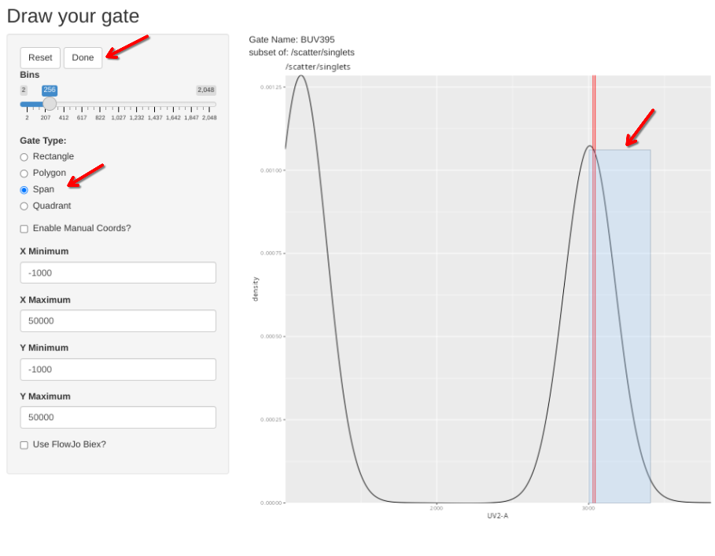

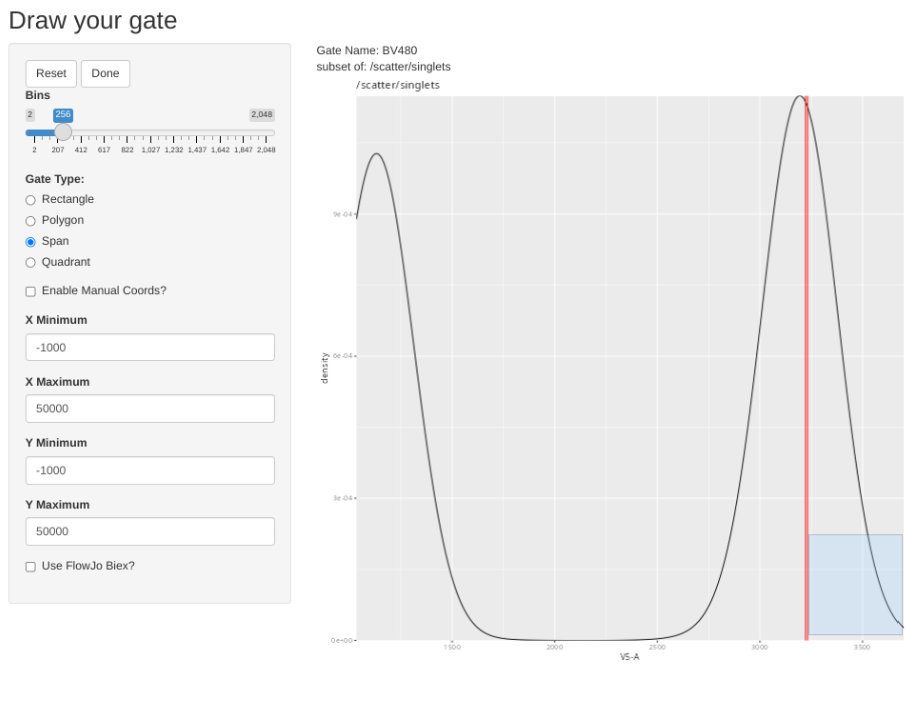

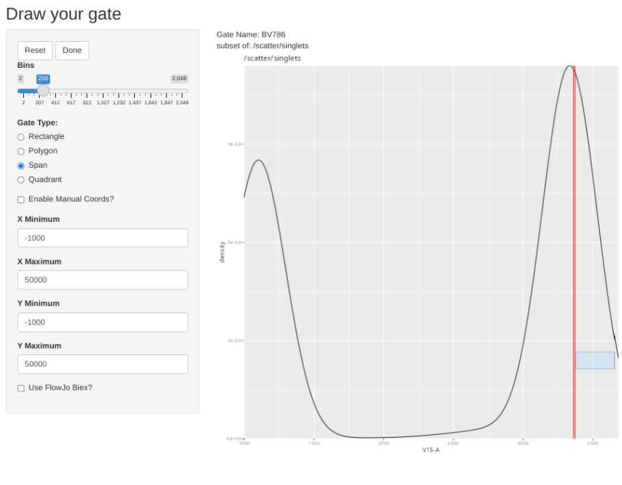

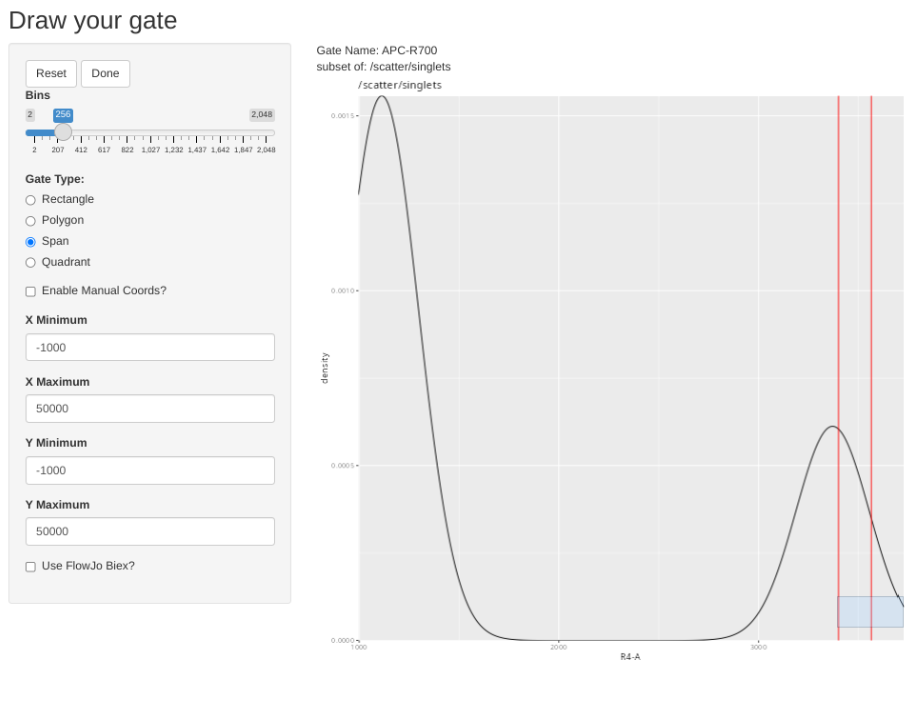

### Saving the GatingSet

As we saw, this allows for a rapid initial setup and adjustment of span gates for the peak detector gates matched to their corresponding single-color fluorophore. Now that those gates were created and adjusted, lets save out another intermediate .gs file for subsequent use. 

```{r}
#| eval: FALSE
BeadsSCSaveHere <- file.path(OutputLocation, "BeadsSCs_GS_Amplified.gs")

save_gs(BeadsSC_GatingSet, BeadsSCSaveHere)

# BeadsSC_GatingSet <- load_gs(BeadsSCSaveHere )
```

### Retrieving Average Signature

At this point, we have created the peak detector gates, and adjusted them on basis of their respective single-color unmixing controls. Now, we just need to retrieve the cells present in those gates, reverse the transformation, and take the average measurement across each detector to get back the combination of the fluorophore + autofluorescence signal. 

As we saw during [Week 12](), individually this can be done relatively simply. But when we start talking specifying out the code for 10, 20, 30, 40, 50 or 60 fluorophores, we end up considering where in life we went wrong and ended up in this line of work. In an attempt to keep us sane just a little longer, we can use the `RetrieveAverageSignature()` function to manage this step for each of the rows present in our assembled template. 

```{r}
#| eval: FALSE
UpdatedTemplate <- RetrieveAverageSignature(template=KeptBeads, gs=BeadsSC_GatingSet, inverse.transform = TRUE)
UpdatedTemplate
```

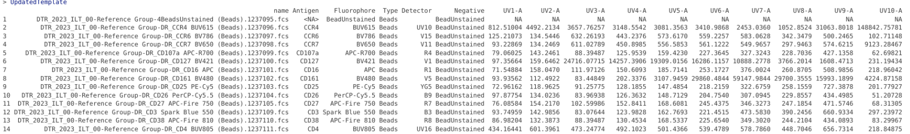

As we can see, the retrieved signature values for each fluorophore have been appended on as additional columns. These values still are the combination of both the fluorophore and background, so we need to mediate the autofluorescence subtraction. To do this, we first need to retrieve and add back in the background signal for our negative (BeadsUnstained) which currently is showing up as NA values for its respective row. 

```{r}
#| eval: FALSE
BeadUnstained <- GateExprsIterated(gs=BeadsSC_GatingSet, sample=1,
 gate="singlets", excludeThese="FSC|SSC|Time|-H")

BeadUnstained[1,1] <- "BeadUnstained"

BeadUnstained
```

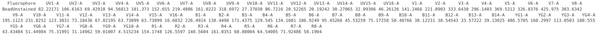

Checking to the UpdatedTemplate, which has the existing columns

```{r}
#| eval: FALSE
colnames(UpdatedTemplate)
```

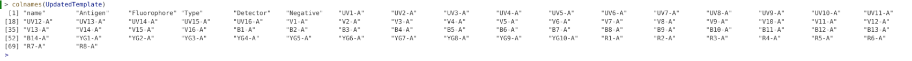

So, knowing which row and which column, lets paste it back in

```{r}
#| eval: FALSE
UpdatedTemplate[1,7:ncol(UpdatedTemplate)] <- BeadUnstained[2:ncol(BeadUnstained)]

UpdatedTemplate[1,2] <- "BeadUnstained"
UpdatedTemplate
```

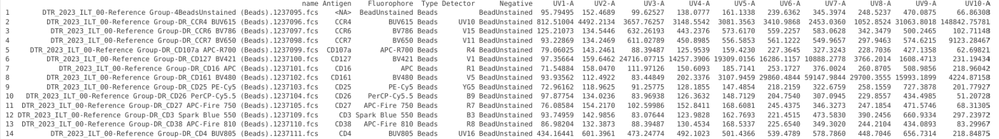

### Background Subtraction

With the template now containing the detector values for both our fluorophores, as well as the unstained, we can now proceed to subtract out the background. This can be done using the `BackgroundSubtraction()` wrapper from `Lucierngaga`, which mediates the subtraction by matching the name found in the Negative column to the matching unstained name found in the Fluorophore column. We also have the option to go ahead and normalize (i.e. scale the signal from 0 to 1) and whether to keep the unstained values or not (in this case since we are working with beads, lets keep it FALSE (since we won't be calculating bead autofluorescence from our cells at the time of unmixing))

```{r}
#| eval: FALSE
BeadFluorophoreSignatures <- BackgroundSubtraction(data=UpdatedTemplate, Normalize=TRUE, keepNegatives=FALSE)
```

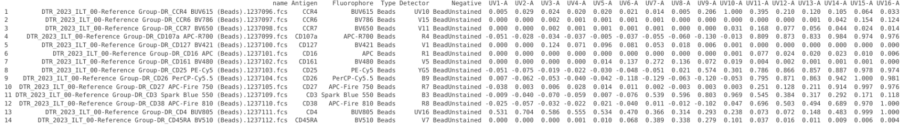

Before we go anywhere else, lets save this signature matrix out as a .csv for safe keeping/comparison. 

```{r}
#| eval: FALSE
StoreHere <- file.path(OutputLocation, "BeadInitialSignatureMatrix.csv")
write.csv(BeadFluorophoreSignatures, StoreHere, row.names=FALSE)
```

Which can then subsequently be read back in

```{r}
StoreHere <- file.path(OutputLocation, "BeadInitialSignatureMatrix.csv")
BeadFluorophoreSignatures <- read.csv(StoreHere, check.names=FALSE)
```

Alright, lets check and see how atrocious our initial span gates really were

```{r}
Plot <- VisualizeSignatures(columnname="Fluorophore", data=BeadFluorophoreSignatures,
 Normalize=FALSE, characterColumns="Fluorophore")

plotly::ggplotly(Plot)
```

And those look relatively reasonable at first glance, lets power on and tackle the cell single-color unmixing controls next. 

## Cell Single-Colors

Having made our way through the bead single color unmixing controls, lets repeat the process with the cell single colors. To do this, let load them in from their intermediate .gs

```{r}
#| eval: FALSE
CellSCsStoredHere <- file.path(OutputLocation, "CellsSCs_GS.gs")
CellsSC_GatingSet <- load_gs(CellSCsStoredHere )
```

### Updating Metadata

Lets quickly check the existing metadata, and see if the names have changed compared to the bead unmixing controls

```{r}
#| eval: FALSE
pData(CellsSC_GatingSet)
```

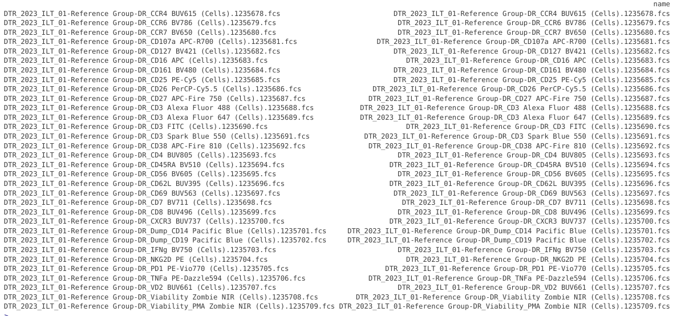

Overall, the name syntax for these files is similar to what we saw for the bead single-color unmixing controls. We will likely be able to use the same extraction code we used for the beads, with only a few modifications needed. 

```{r}
#| eval: FALSE
cell_pd <- pData(CellsSC_GatingSet)

Updated_cell_pd <- cell_pd |> mutate(
    raw = str_extract(name, "(?<=DR_)[^(]+(?=\\()"), 
    Antigen = raw |>
      str_trim() |>
      str_extract("^\\S+"), 
    Fluorophore = raw |>
      str_trim() |>
      str_remove("^\\S+\\s+"), 
    Type = name |>
      str_extract("(?<=\\()([^)]+)(?=\\))"),
    raw = NULL
  )

Updated_cell_pd <- Updated_cell_pd |> relocate(Fluorophore, Antigen, Type, .after="name")

Updated_cell_pd
```

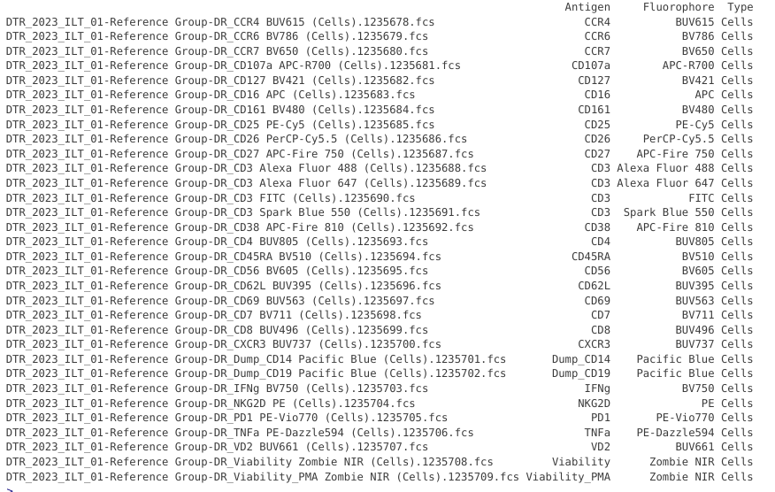

Since no unstained samples are present in this GatingSet, the only adjustment we need to carry out is changing PE-Vio770 and PE-Dazzle594 to include the space in the name to allow the `DetectorGuess()` function to correctly assign the peak detector later on. 

```{r}
#| eval: FALSE
Updated_cell_pd <- Updated_cell_pd |> 
  mutate(Fluorophore = case_when(
    Fluorophore == "PE-Vio770" ~ "PE-Vio 770",
    Fluorophore == "PE-Dazzle594" ~ "PE-Dazzle 594",
    TRUE ~ Fluorophore
  ))

pData(CellsSC_GatingSet) <- Updated_cell_pd
pData(CellsSC_GatingSet)
```

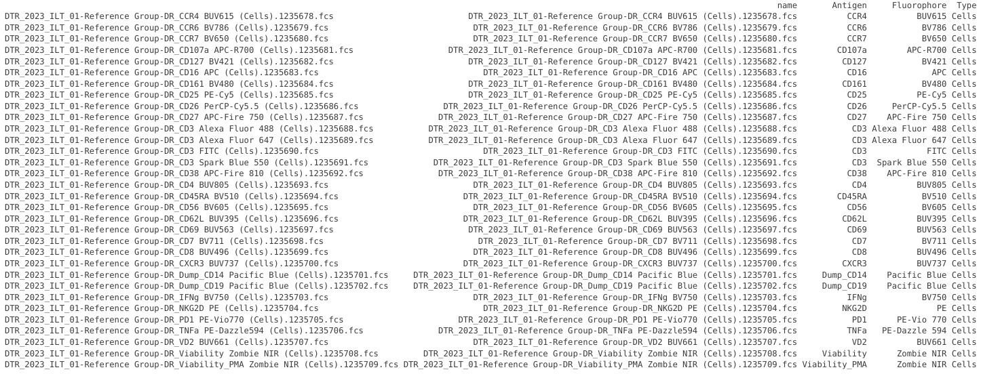

### Template Set Up

At this point, we can proceed to generate the template that we will need for gating. In this case, lets start off by specifying everything as using a "CellUnstained" negative, and then iterate through the Fluorophore column with `DetectorGuess()` to retrieve the peak detectors. 

```{r}
#| eval: FALSE
Template <- pData(CellsSC_GatingSet)
Template <- Template |> mutate(Detector="", Negative="CellUnstained")

Template <- Template |> mutate(
    Detector = map_chr(Fluorophore, \(f) DetectorGuess(x = f, NumberDetectors = 64))
  )

Template
```

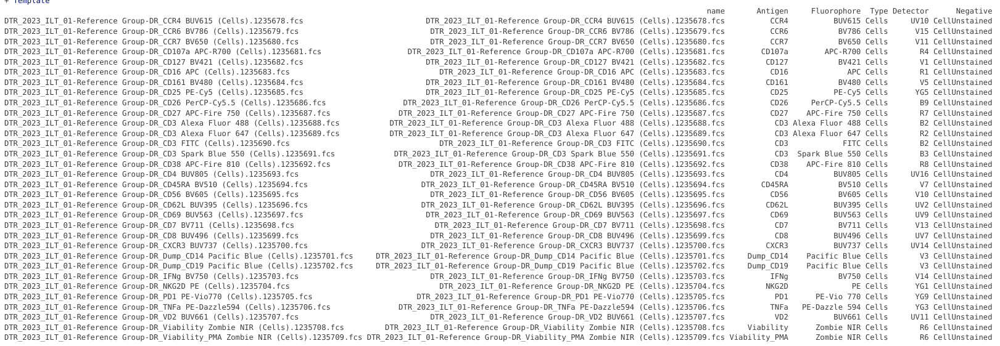

In this case, however, we have a bit more variety in terms of the negative background being used. Squinting at the [lab notebook](https://github.com/DavidRach/LabNotebook/blob/main/2023/2023-05-12.pdf) scan

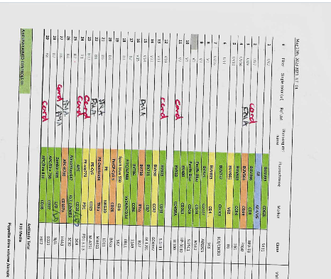

Looks like the CD8 (BUV496), CD45RA (BV510), CD56 (BV605), PD1 (PE-Vio 770), CD16 (APC), CD38 (APC-Fire 810), and 1 of the Viability (Zombie NIR) were prepared using extra cord blood mononuclear cells. Similarly, the CD69 (BUV563), TNFa (PE-Dazzle 594), IFNg (BV750), CD107a (APC-R700), CD25 (PE-Cy5) and the other Viability (Zombie NIR) were prepared using PMA-ionomycin stimulated PBMC. All other controls would have been unstimulated PBMC. 

And as was previously mentioned, we will need to match the cell gating background for the Pacific Blue CD14 (Monocyte gated) and both Zombie NIR controls (dead cell gated) when the time comes. 

To cut down on the modifications needed in the future, lets modify the template to account for these different negative backgrounds using the `dplyr` packages `case_when()` and `mutate()` functions. 

```{r}
#| eval: FALSE
Updated_cell_pd <- Template |> 
  mutate(Negative = case_when(
    # Different Gate Placements
    Antigen == "Dump_CD14" ~ "PBMC_Monocyte_Unstained",
    Antigen == "Viability" ~ "CBMC_Dead_Unstained",
    Antigen == "Viability_PMA" ~ "PBMC_Dead_Unstained", 
    # CBMC 
    Antigen == "CD8" ~ "CBMC_Unstained",
    Antigen == "CD45RA" ~ "CBMC_Unstained",
    Antigen == "CD56" ~ "CBMC_Unstained", 
    Antigen == "PD1" ~ "CBMC_Unstained",
    Antigen == "CD16" ~ "CBMC_Unstained",
    Antigen == "CD38" ~ "CBMC_Unstained", 
    # PMA-stimulated PBMC
    Antigen == "CD69" ~ "PBMC_Activated_Unstained",
    Antigen == "TNFa" ~ "PBMC_Activated_Unstained",
    Antigen == "IFNg" ~ "PBMC_Activated_Unstained", 
    Antigen == "CD107a" ~ "PBMC_Activated_Unstained",
    Antigen == "CD25" ~ "PBMC_Activated_Unstained", 
    # All Others
    TRUE ~ "PBMC_Unstained"
  ))

Updated_cell_pd <- Updated_cell_pd |> relocate(Fluorophore, Antigen, Type, Detector, Negative, .after="name")
```

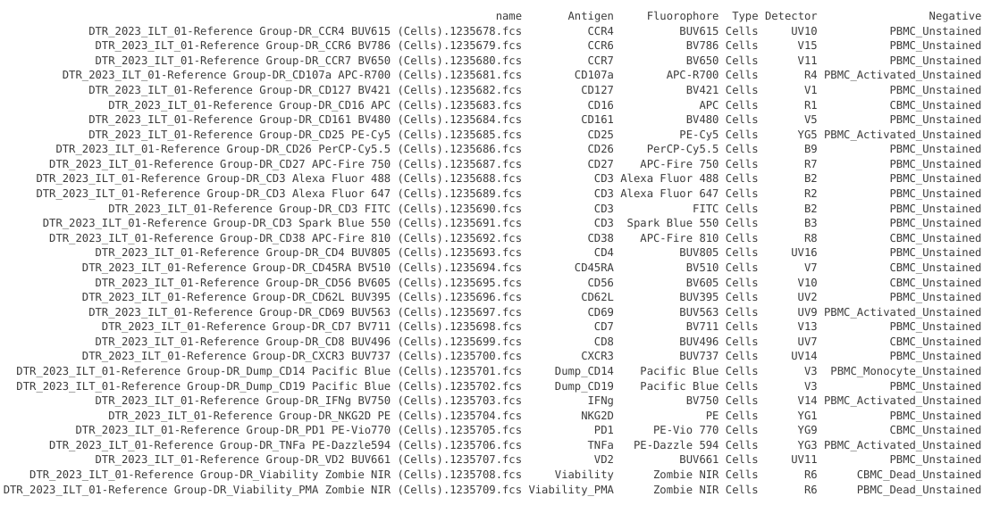

With these adjustments made, we can then proceed to incorporate it back into the GatingSet metadata via the assignment arrow and `pData()` function

```{r}
#| eval: FALSE
pData(CellsSC_GatingSet) <- Updated_cell_pd
```

And for insurance purposes, lets go ahead and store it as a .csv file as well. 

```{r}
#| eval: FALSE
Template <- pData(CellsSC_GatingSet)
StoreHere <- file.path(OutputLocation, "CellMatch.csv")
write.csv(Template, StoreHere, row.names=FALSE)
```

```{r}
StoreHere <- file.path(OutputLocation, "UpdatedCellMatch.csv")
CellMatchTemplate <- read.csv(StoreHere, check.names=FALSE)
```

### Removing Duplicates

Once again, lets check for duplicates

```{r}
CellMatchTemplate |> group_by(Fluorophore) |> mutate(Count=row_number()) |>
     ungroup() |> filter(Count > 1) |> pull(Fluorophore) # Spot duplicated fluorophore references
```

Both Pacific Blue and Zombie NIR come up as we had encountered with the beads. Checking the files, we opt to keep the duplicate that contains the brighter staining events. This results in keeeping Pacific Blue Dump_CD14 which is considerably brighter compared to the CD19, and the CBMC based Zombie NIR viability control (which is brighter than the PMA-ionomycin stimulated PBMC sample). We can also also exclude the redundant Alexa Fluor 488 control. 

```{r}
KeptCells <- CellMatchTemplate |>
     filter(!name %in% "DTR_2023_ILT_01-Reference Group-DR_Dump_CD19 Pacific Blue (Cells).1235702.fcs") |>
     filter(!name %in% "DTR_2023_ILT_01-Reference Group-DR_Viability_PMA Zombie NIR (Cells).1235709.fcs") |>
     filter(!name %in% "DTR_2023_ILT_01-Reference Group-DR_CD3 Alexa Fluor 488 (Cells).1235688.fcs") 
KeptCells
```

Considering this panel has 29-fluorophores, and we have 29-rows, looks like we are good. We will need to add in the unstaineds separately later on. 


### Initial UnmixSpanGates

Before creating the peak detector gates, lets double check the existing gates for the CellsSC_GatingSet

```{r}
#| eval: FALSE
plot(CellsSC_GatingSet)
```

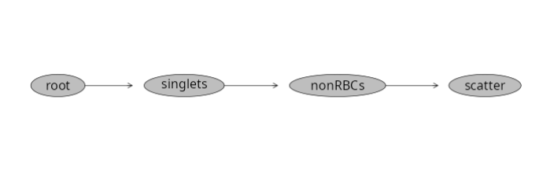

At this point, we can proceed to create the initial peak detector gates via `InitialUnmixSpanGagtes()`, placing them under the existing "scatter" cleanup gate, monitoring the progress bar as we wait. 

```{r}
#| eval: FALSE
InitialUnmixSpanGates(template=KeptCells, gs=CellsSC_GatingSet, subset="scatter", minpercentile=0.75, maxpercentile = 0.99)
```

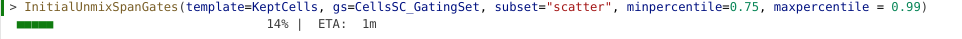

We can then quickly verify that the initial peak detector gates have been created. 

```{r}
#| eval: FALSE
plot(CellsSC_GatingSet)
```

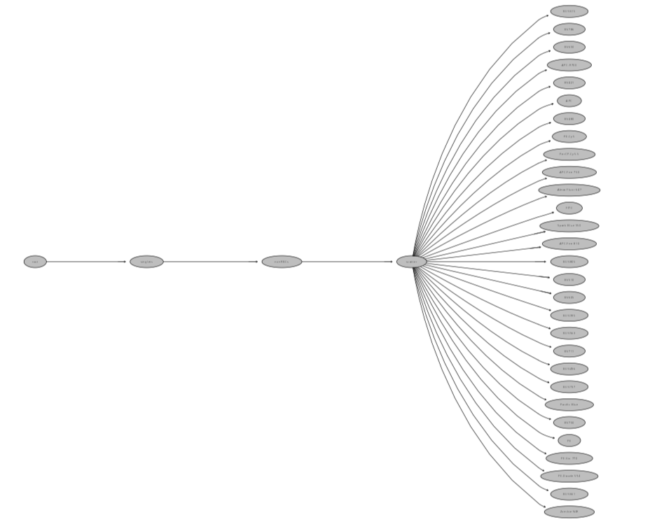

### Remaining Gate Adjustment

At the moment, all the initial peak detector gates have been created based of the parent "scatter" gate. However, for Zombie NIR Viability we are set to use a CBMC dead gate, and for Pacific Blue CD14 we will be using the monocytes gate. Before proceeding, we should double check that the previous gate shifts implemented are still in place.

```{r}
#| eval: FALSE
pData(CellsSC_GatingSet) |> mutate(WhereAt = dplyr::row_number())
```

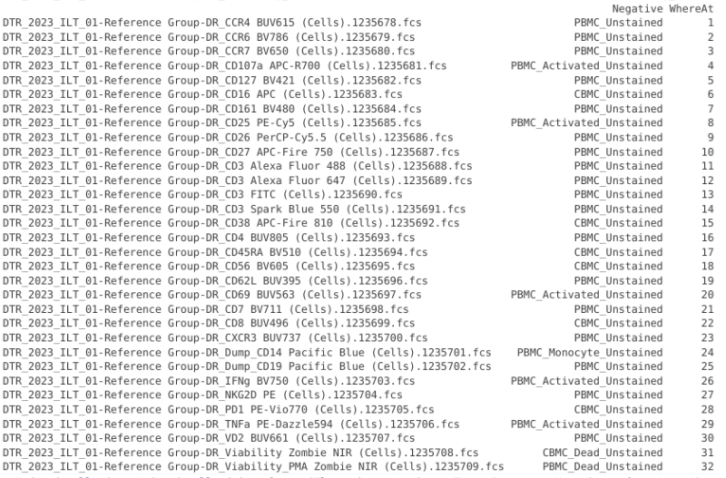

```{r}
#| eval: FALSE

# PacificBlue Dump_CD14 is #24 based off above pData
gs_apply_gate_check(gs=CellsSC_GatingSet, gate="scatter", sample=24, AdjustAll=FALSE)
```

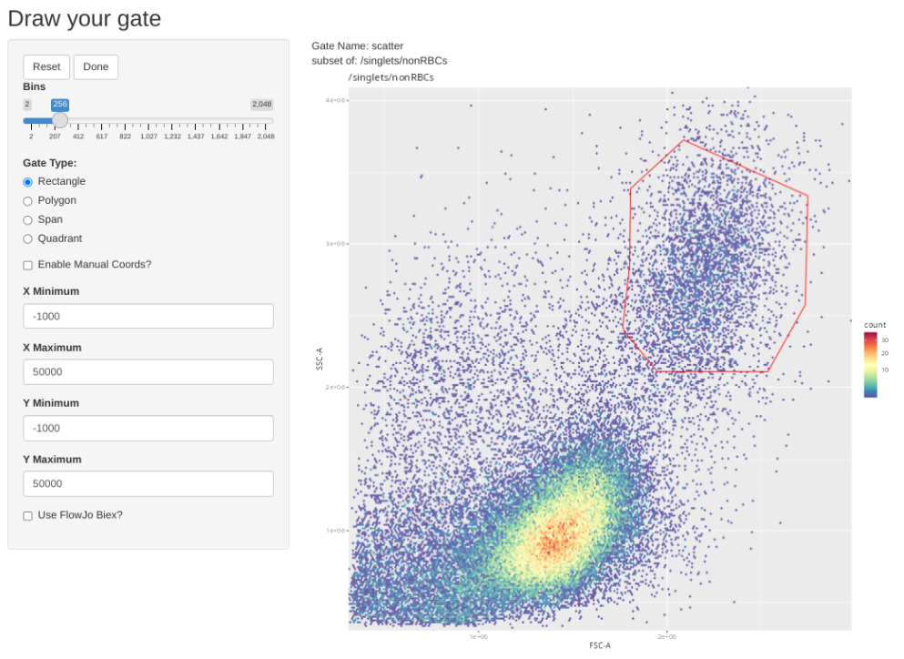

```{r}
#| eval: FALSE

# Zombie NIR CBMC is #31 based off above pData
gs_apply_gate_check(gs=CellsSC_GatingSet, gate="scatter", sample=31, AdjustAll=FALSE)
```

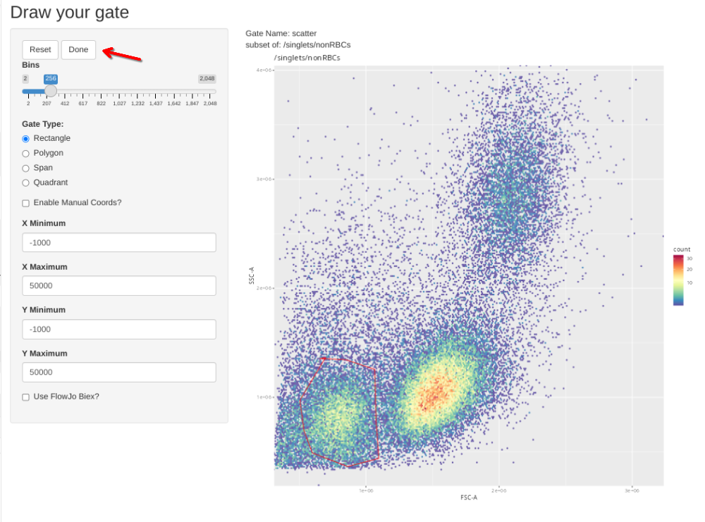


### Checking UnmixingSpanGates

With the peak detector gates now created, we can run `CheckUnmixingSpanGates()` to iterate through them and allow us to adjust any of the spans that are off via the `flowGate` ShinyApp. 

```{r}
#| eval: FALSE
CheckUnmixingSpanGates(template=KeptCells, gs=CellsSC_GatingSet, AdjustAll=TRUE)
```

If the gate is good as is, just click done to move to the next specimen

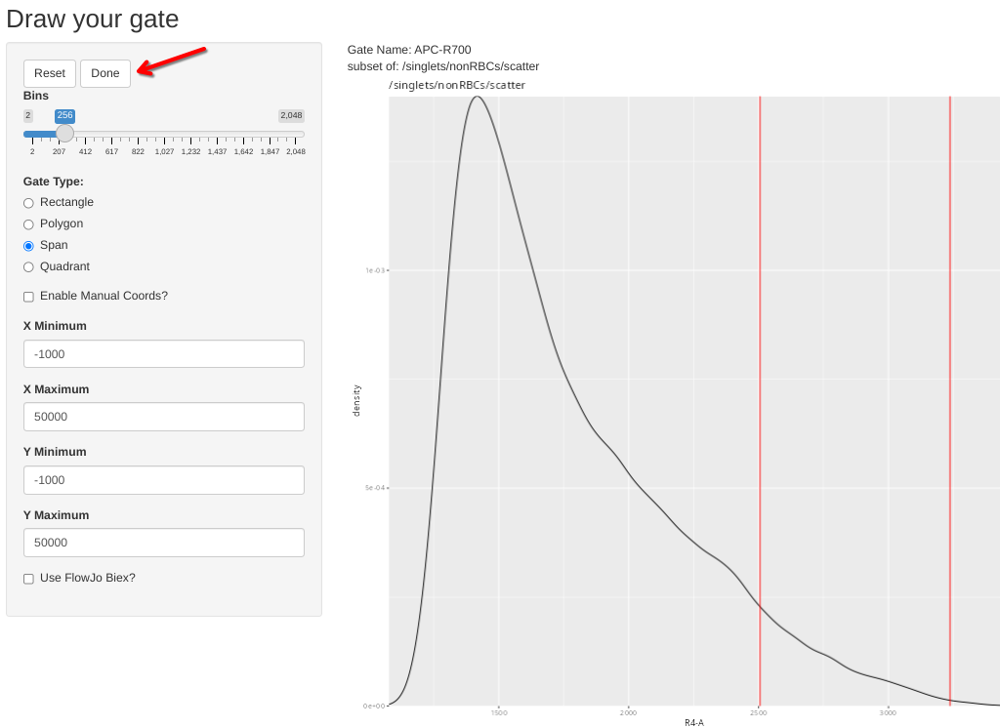

Alternatively, draw a span, and then select done

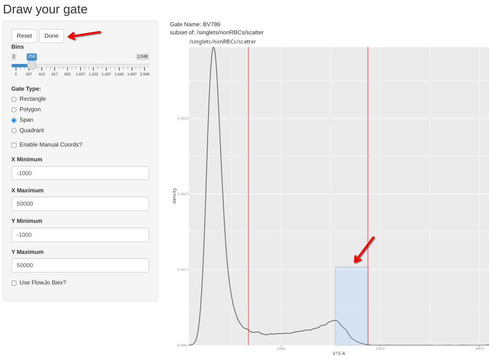

And repeat for the rest of the single-colors, attempting as much as possible to stick to the best practices for unmixing controls. 

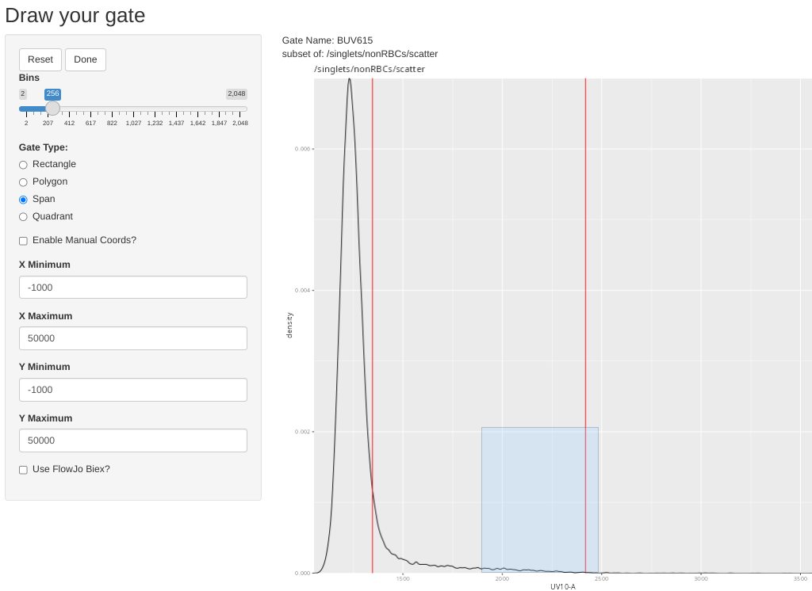

### Saving the GatingSet

Having created the peak detector gates, and ensured they are not horridly off for their respective single-color control specimens, go ahead and save this state as its own intermediate .gs object to allow for quick reloading for any subsequent steps. 

```{r}
#| eval: FALSE
SaveUpdatedCellSCHere <- file.path(OutputLocation, "CellsSC_GS_Amplified.gs")

save_gs(CellsSC_GatingSet, SaveUpdatedCellSCHere)
# CellsSC_GatingSet <- load_gs(SaveUpdatedCellSCHere)
```

### Retrieving Average Signature

With our span gates checked, we can proceed to expand the template, iterating through each row and retrieving the median signature for each detector using the `RetrieveAverageSignature()` wrapper function. 

```{r}
#| eval: FALSE
#KeptCellsBackup <- KeptCells
#KeptCells <- KeptCellsBackup[10,]

UpdatedTemplate <- RetrieveAverageSignature(template=KeptCells, gs=CellsSC_GatingSet, inverse.transform = TRUE)
```

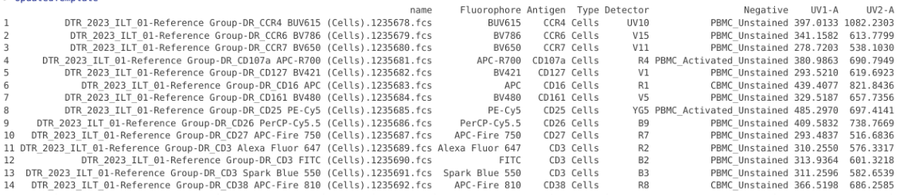


### Assembling Negative Backgrounds

Unlike the Bead GatingSet that contained its own unstained, we will need to select several unstained samples to use as background subtraction for our single-colors. 

```{r}
KeptCells |> pull(Negative) |> unique()
```

#### UnstainedGS

Lets retrieve the CellUnstained_GS from where we stored it as a .gs folder in the last walkthrough. 

```{r}
#| eval: FALSE
UnstainedIntermediateStoredHere <- file.path(OutputLocation, "CellsUnstained_GS.gs")
Unstained_GatingSet <- load_gs(UnstainedIntermediateStoredHere)
```

```{r}
#| eval: FALSE
pData(Unstained_GatingSet)
```

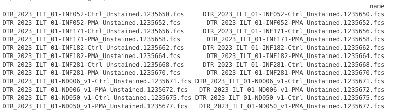

#### Drawing Final Gates

After squinting away through our [lab notebook](https://github.com/DavidRach/LabNotebook/blob/main/2023/2023-05-12.pdf) scan, it looks like the PBMC controls were sourced from the ND006 specimens. CBMC originated from INF052 specimen.  We still need to draw a monocyte and dead cell gates, since the current gating scheme appears as follows

```{r}
#| eval: FALSE
plot(Unstained_GatingSet)
```


Lets tackle the addition of those new gates first, basing them off the parent gate (nonRBCs)

```{r}
#| eval: FALSE
pd <- pData(Unstained_GatingSet)
pd |> mutate(WhichRow = dplyr::row_number())
```

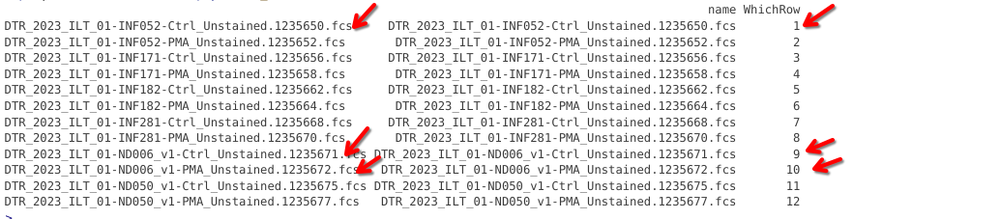

First lets create a Monocyte gate based off the CBMC specimen. 

```{r}
#| eval: FALSE

flowGate::gs_gate_interactive(gs=Unstained_GatingSet, filterId="Monocytes", sample=1,
dims=list("FSC-A", "SSC-A"), subset="nonRBCs") # INF052 Control
```

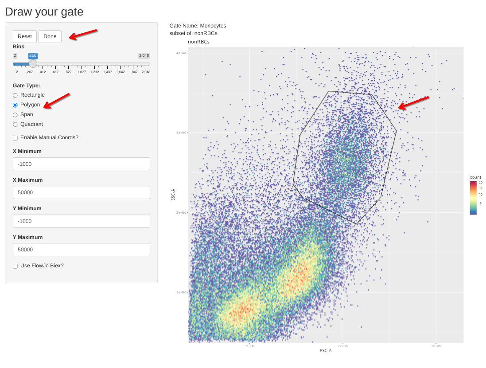

And lets check it for the adult PBMC specimen without stimulation. 

```{r}
#| eval: FALSE
gs_apply_gate_check(gs=Unstained_GatingSet, gate="Monocytes", sample=9, AdjustAll=FALSE)
```

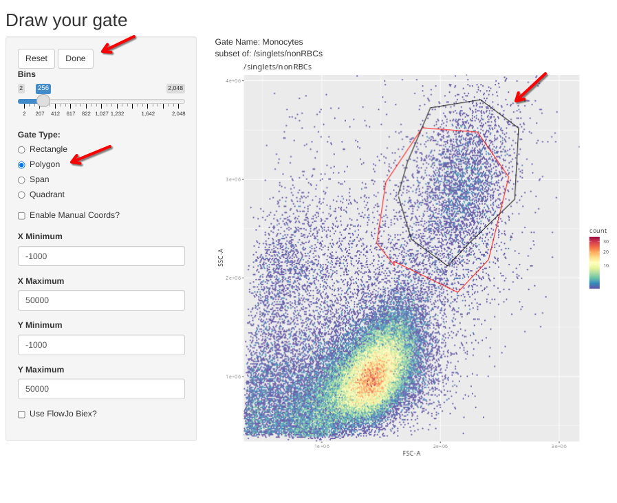

We can then draw gates for dead/dying CBMC

```{r}
#| eval: FALSE
flowGate::gs_gate_interactive(gs=Unstained_GatingSet, filterId="CordDead", sample=1,
dims=list("FSC-A", "SSC-A"), subset="nonRBCs") # INF052 Control
```

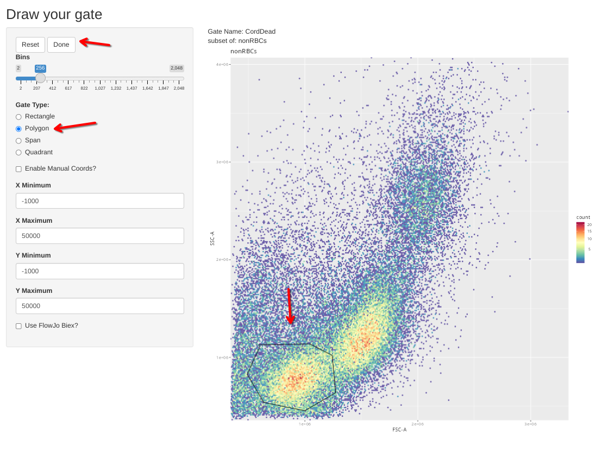

As well as dead/dying PBMC following PMA-ionomycin activation

```{r}
#| eval: FALSE
flowGate::gs_gate_interactive(gs=Unstained_GatingSet, filterId="PBMCDead", sample=10,
dims=list("FSC-A", "SSC-A"), subset="nonRBCs", regate=TRUE) # NDOO6 PMA
```

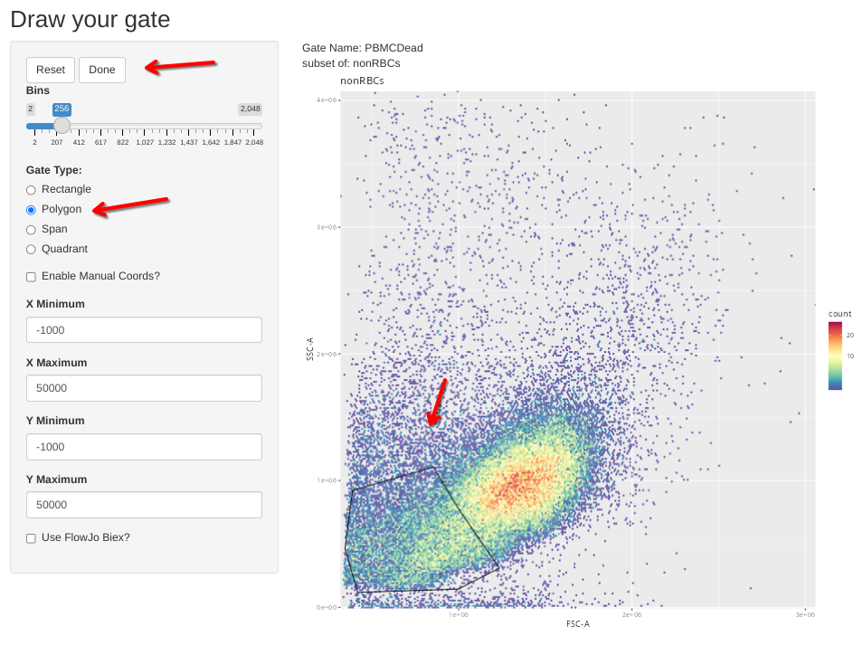

And if we now check the created gates

```{r}
#| eval: FALSE
plot(Unstained_GatingSet)
```

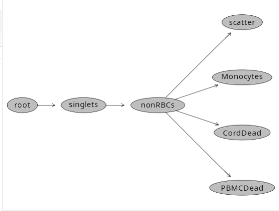

#### Saving the GatingSet

And now that these final gates are drawn and adjusted, lets go ahead and similarly save this GatingSet out as a new intermediate .gs folder for future use. 

```{r}
#| eval: FALSE
CellUnstainedStoredHere <- file.path(OutputLocation, "CellsUnstained_GS_Amplified.gs")

save_gs(Unstained_GatingSet, CellUnstainedStoredHere)
# Unstained_GatingSet <- load_gs(CellUnstainedStoredHere)
```


#### Extracting Autofluorescence Signature

Now that we have the unstained specimens loaded, and last of the positional gates created, we are ready to extract out the signatures from each, and tidy the data to match the template format being used by our single colors. Lets start by first extracting the median fluorescent signature values for each. 

```{r}
#| eval: FALSE

# gs_apply_gate_check(gs=Unstained_GatingSet, gate="scatter", sample=9, AdjustAll=FALSE)
# plot(Unstained_GatingSet)

PBMC_Unstained <- GateExprsIterated(gs=Unstained_GatingSet, sample=9,
 gate="scatter", excludeThese="FSC|SSC|Time|-H", inverse.transform=TRUE)

PBMC_Unstained[1,1] <- "PBMC_Unstained"
```

```{r}
#| eval: FALSE

# pData(CellsSC_GatingSet) |> mutate(WhichRow=row_number())
# gs_apply_gate_check(gs=CellsSC_GatingSet, gate="Pacific Blue", sample=24, AdjustAll=FALSE)
# gs_apply_gate_check(gs=Unstained_GatingSet, gate="Monocytes", sample=9, AdjustAll=FALSE)
# plot(Unstained_GatingSet)

PBMC_Monocyte_Unstained <- GateExprsIterated(gs=Unstained_GatingSet, sample=9,
 gate="Monocytes", excludeThese="FSC|SSC|Time|-H", inverse.transform=TRUE)

PBMC_Monocyte_Unstained[1,1] <- "PBMC_Monocyte_Unstained"
```

```{r}
#| eval: FALSE

# gs_apply_gate_check(gs=Unstained_GatingSet, gate="scatter", sample=10, AdjustAll=FALSE)
# plot(Unstained_GatingSet)

PBMC_Activated_Unstained <- GateExprsIterated(gs=Unstained_GatingSet, sample=10,
 gate="scatter", excludeThese="FSC|SSC|Time|-H", inverse.transform=TRUE)

PBMC_Activated_Unstained[1,1] <- "PBMC_Activated_Unstained"
```

```{r}
#| eval: FALSE

# gs_apply_gate_check(gs=Unstained_GatingSet, gate="PBMCDead", sample=10, AdjustAll=FALSE)
# plot(Unstained_GatingSet)

PBMC_Dead_Unstained <- GateExprsIterated(gs=Unstained_GatingSet, sample=10,
 gate="PBMCDead", excludeThese="FSC|SSC|Time|-H", inverse.transform=TRUE)


PBMC_Dead_Unstained[1,1] <- "PBMC_Dead_Unstained"
```

```{r}
#| eval: FALSE

# gs_apply_gate_check(gs=Unstained_GatingSet, gate="scatter", sample=1, AdjustAll=FALSE)
# plot(Unstained_GatingSet)

CBMC_Unstained <- GateExprsIterated(gs=Unstained_GatingSet, sample=1,
 gate="scatter", excludeThese="FSC|SSC|Time|-H", inverse.transform=TRUE)

CBMC_Unstained[1,1] <- "CBMC_Unstained"
```

```{r}
#| eval: FALSE

# gs_apply_gate_check(gs=Unstained_GatingSet, gate="CordDead", sample=1, AdjustAll=FALSE)
# plot(Unstained_GatingSet)

CBMC_Dead_Unstained <- GateExprsIterated(gs=Unstained_GatingSet, sample=1,
 gate="CordDead", excludeThese="FSC|SSC|Time|-H", inverse.transform=TRUE)

CBMC_Dead_Unstained[1,1] <- "CBMC_Dead_Unstained"
```

And lets go ahead and combine these together into a data.frame to simplify the data tidying steps downstream. 

```{r}
#| eval: FALSE
UnstainedData <- bind_rows(PBMC_Unstained, PBMC_Monocyte_Unstained, PBMC_Activated_Unstained, 
  PBMC_Dead_Unstained, CBMC_Unstained, CBMC_Dead_Unstained)

UnstainedData
```

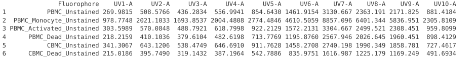

```{r}
#| include: FALSE
#| eval: FALSE

UnstainedSignaturesStoredHere <- file.path(OutputLocation, "UnstainedSignatures.csv")
write.csv(UnstainedData, UnstainedSignaturesStoredHere, row.names=FALSE)
```

```{r}
#| include: FALSE

UnstainedSignaturesStoredHere <- file.path(OutputLocation, "UnstainedSignatures.csv")
UnstainedData <- read.csv(UnstainedSignaturesStoredHere, check.names=FALSE)
```

#### Visualizing Autofluorescencce signatures

And for curiosity while we are here, lets visualize the signatures, both raw and normalized

```{r}
Plots <- Luciernaga::VisualizeSignatures(data=UnstainedData, columnname="Fluorophore", Normalize = FALSE)
plotly::ggplotly(Plots)
```

```{r}
Plots <- Luciernaga::VisualizeSignatures(data=UnstainedData, columnname="Fluorophore", Normalize = TRUE)
plotly::ggplotly(Plots)
```

So overall, some differences in brightness, but mostly appear to be similar in terms of normalized signature. 

### Data Tidying

Now that we have the signature values for the detector columns and identifying "Fluorophore" name, we need to do some data tidying to fit these values from our unstained controls into the format needed for the Background subtraction template. 

Lets start by slicing the first row from our existing template. 
```{r}
#| eval: FALSE
CellStandin <- UpdatedTemplate |> slice(1)
```

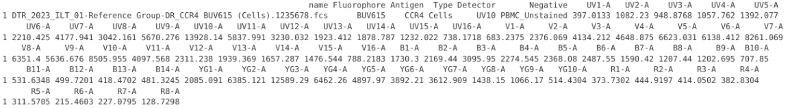

Lets then duplicate the rows to match the number of rows in UnstainedData

```{r}
#| eval: FALSE
CellStandin <- CellStandin[rep(1, nrow(UnstainedData)), ]
rownames(CellStandin) <- NULL
```

Lets now follow up by blanking some of the metadata columns

```{r}
#| eval: FALSE

# Note: PLEASE VERIFY CORRECT COLUMNS WHEN HARD-CODING LIKE THIS
# colnames(CellStandin)

CellStandin[,1] <- "" # name
CellStandin[,2] <- "" # Fluorophore
CellStandin[,3] <- "" # Antigen
CellStandin[,4] <- "Cells" # Type
CellStandin[,5] <- "" # Detector
CellStandin[,6] <- "" # Negative

CellStandin
```

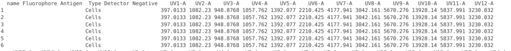

Lets cut and paste in the detector values over from UnstainedData into CellStandin, and then place the names into a few of the metadata column locations. 

```{r}
#| eval: FALSE
CellStandin[,7:ncol(CellStandin)] <- UnstainedData[2:ncol(UnstainedData)]
CellStandin[,c(1,2,6)] <- UnstainedData[1]
CellStandin
```

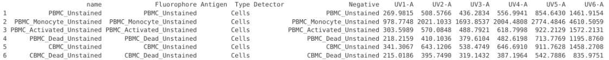

At this point, we can combine in with the UpdatedTemplate to form the completed template we need for background subtraction. 

```{r}
#| eval: FALSE
UpdatedTemplate <- bind_rows(CellStandin, UpdatedTemplate)
UpdatedTemplate
```

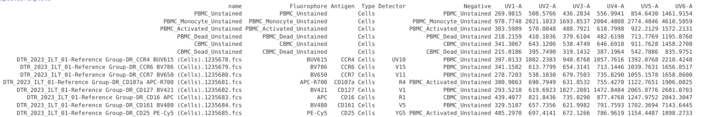

### Background Subtraction

With the template now assembled, lets proceed to subtract out the correct background from each of the single-color controls

```{r}
#| eval: FALSE
CellFluorophoreSignatures <- BackgroundSubtraction(data=UpdatedTemplate, Normalize=TRUE, keepNegatives=TRUE)
```

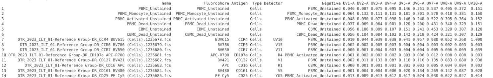

And once again, before we loose our hard work, lets go ahead and save these initial signatures to a .csv file. 

```{r}
#| eval: FALSE
StoreHere <- file.path(OutputLocation, "CellInitialSignatureMatrix.csv")
write.csv(CellFluorophoreSignatures, StoreHere, row.names=FALSE)
```

Which can then subsequently be read back in

```{r}
StoreHere <- file.path(OutputLocation, "CellInitialSignatureMatrix.csv")
CellFluorophoreSignatures <- read.csv(StoreHere, check.names=FALSE)
```

And lets visualize the outputs

```{r}
Plot <- VisualizeSignatures(columnname="Fluorophore", data=CellFluorophoreSignatures,
 Normalize=FALSE, characterColumns="Fluorophore")

plotly::ggplotly(Plot)
```

# Take Away

In this walk-through, we explored how to orchestrate the creation and adjustment of peak detector gates for our single-color controls. Once these gates were setup, for every fluorophore in our panel, we extracted the median values for the cells contained within those gates, subtracted the background and then normalized the values. These signature matrices where then stored as .csv files so that we can compare and contrast the signatures during another walkthrough. Whether the extracted averaged fluorescent signatures are indeed correct and will function properly in unmixing (or if we need to go back and redraw our spanGates), is something we will explore again in the next walk-through.

# Additional Resources

[Examples]()

::: {style="text-align: right;"}
[](https://www.gnu.org/licenses/agpl-3.0.en.html) [](http://creativecommons.org/licenses/by-sa/4.0/)
:::
